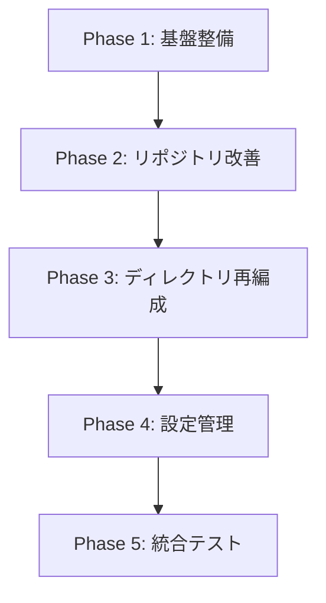

# Infrastructure 層クリーンアーキテクチャ改善実装計画

## 1. 実装概要

本計画書は、設計書に基づいて infrastructure 層の改善を段階的に実装するための詳細な手順を定義します。

## 2. 実装フェーズ

### Phase 1: 基盤整備（推定工数: 4-6 時間）

#### 1.1 Mapper クラスの実装

**タスク 1: 基底 Mapper クラスの作成**
```
ファイル: app/infrastructure/database/mappers/base_mapper.py
- 抽象基底クラスの作成
- ジェネリック型を使用した型安全な設計
```

**タスク 2: ListedInfoMapper の実装**
```
ファイル: app/infrastructure/database/mappers/listed_info_mapper.py
- ListedInfo ⇔ ListedInfoModel の相互変換
- StockCode の値オブジェクト変換
- None ハンドリング
```

**タスク 3: Mapper のテスト作成**
```
ファイル: tests/unit/infrastructure/database/mappers/test_listed_info_mapper.py
- 正常系の変換テスト
- エッジケース（None 値）のテスト
- 型チェックテスト
```

#### 1.2 型定義の追加

**タスク 4: J-Quants API レスポンス型の定義**
```
ファイル: app/infrastructure/external_services/jquants/types/responses.py
- TypedDict を使用した型定義
- オプショナルフィールドの明示
```

**タスク 5: インフラ層例外の定義**
```
ファイル: app/infrastructure/exceptions.py
- 基底例外クラス
- 具体的な例外クラス（Database, ExternalAPI, Cache）
```

### Phase 2: リポジトリとクライアント改善（推定工数: 6-8 時間）

#### 2.1 リポジトリ実装の改善

**タスク 6: ListedInfoRepositoryImpl の改修**
```
変更内容:
- コンストラクタに Mapper を注入
- save_all メソッドで Mapper を使用
- find 系メソッドで Mapper を使用
- 冗長なマッピングコードの削除
```

**タスク 7: リポジトリテストの更新**
```
ファイル: tests/unit/infrastructure/repositories/test_listed_info_repository_impl.py
- Mapper のモック追加
- 既存テストの動作確認
```

#### 2.2 外部 API クライアントの型安全化

**タスク 8: JQuants クライアントの改修**
```
ファイル: app/infrastructure/external_services/jquants/listed_info_client.py
- レスポンス型の適用
- Dict[str, Any]から TypedDict への移行
- エラーハンドリングの改善
```

**タスク 9: API レスポンス Mapper の作成**
```
ファイル: app/infrastructure/external_services/jquants/mappers/listed_info_mapper.py
- JQuants レスポンス → ListedInfoDTO 変換
- 日付フォーマット変換
- 欠損値のハンドリング
```

### Phase 3: ディレクトリ構造の再編成（推定工数: 4-5 時間）

#### 3.1 ディレクトリ移動とリネーム

**タスク 10: external_services ディレクトリの作成**
```bash
# 実行コマンド
mkdir -p app/infrastructure/external_services
mv app/infrastructure/jquants app/infrastructure/external_services/
rm -rf app/infrastructure/external_api
```

**タスク 11: インポートパスの更新**
```
対象ファイル:
- 全ての jquants クライアント参照箇所
- DI コンテナ設定
- テストファイル
```

**タスク 12: ファクトリーの移動**
```
移動元: app/application/factories/listed_info_factory.py
移動先: app/domain/factories/listed_info_factory.py
- インポートパスの更新
- 責務の明確化
```

### Phase 4: 設定管理の改善（推定工数: 3-4 時間）

#### 4.1 インフラ設定の分離

**タスク 13: インフラ設定クラスの作成**
```
ファイル: app/infrastructure/config/settings.py
- データベース設定
- Redis 設定
- 外部 API 設定
- 環境変数からの読み込み
```

**タスク 14: 既存設定の移行**
```
- core.config からインフラ固有設定を抽出
- infrastructure.config への参照更新
```

### Phase 5: 統合テストとドキュメント（推定工数: 2-3 時間）

**タスク 15: 統合テストの実行**
```
- 全テストスイートの実行
- リグレッションの確認
- パフォーマンステスト
```

**タスク 16: ドキュメントの更新**
```
- ARCHITECTURE.md の更新
- 新しいディレクトリ構造の反映
- 設計判断の記録
```

## 3. 実装順序と依存関係



## 4. リスクと対策

### 4.1 破壊的変更のリスク
- **リスク**: 既存機能の動作不良
- **対策**: 段階的な実装とテストカバレッジの維持

### 4.2 インポートエラーのリスク
- **リスク**: ディレクトリ移動によるインポートエラー
- **対策**: 自動化ツールの使用と網羅的なテスト

### 4.3 パフォーマンス劣化のリスク
- **リスク**: Mapper 層追加によるオーバーヘッド
- **対策**: ベンチマークテストの実施

## 5. 完了基準

### Phase 単位の完了基準
- [ ] 全ての単体テストがパス
- [ ] 型チェック（mypy）がパス
- [ ] コードフォーマット（black, isort）完了
- [ ] 既存機能の動作確認

### 全体の完了基準
- [ ] クリーンアーキテクチャの原則に準拠
- [ ] ドキュメントの更新完了
- [ ] パフォーマンステストで劣化なし
- [ ] コードレビューの承認

## 6. 実装スケジュール（目安）

| Phase | 推定工数 | 実装順序 |
|-------|---------|---------|
| Phase 1 | 4-6 時間 | 1 番目 |
| Phase 2 | 6-8 時間 | 2 番目 |
| Phase 3 | 4-5 時間 | 3 番目 |
| Phase 4 | 3-4 時間 | 4 番目 |
| Phase 5 | 2-3 時間 | 5 番目 |
| **合計** | **19-26 時間** | - |

## 7. 実装時の注意事項

1. **テストファースト**: 可能な限りテストを先に書く
2. **小さなコミット**: 機能単位で細かくコミット
3. **継続的な動作確認**: 各タスク完了時に動作確認
4. **型安全性の確保**: mypy での型チェックを必須とする
5. **ドキュメント同期**: コード変更と同時にドキュメント更新