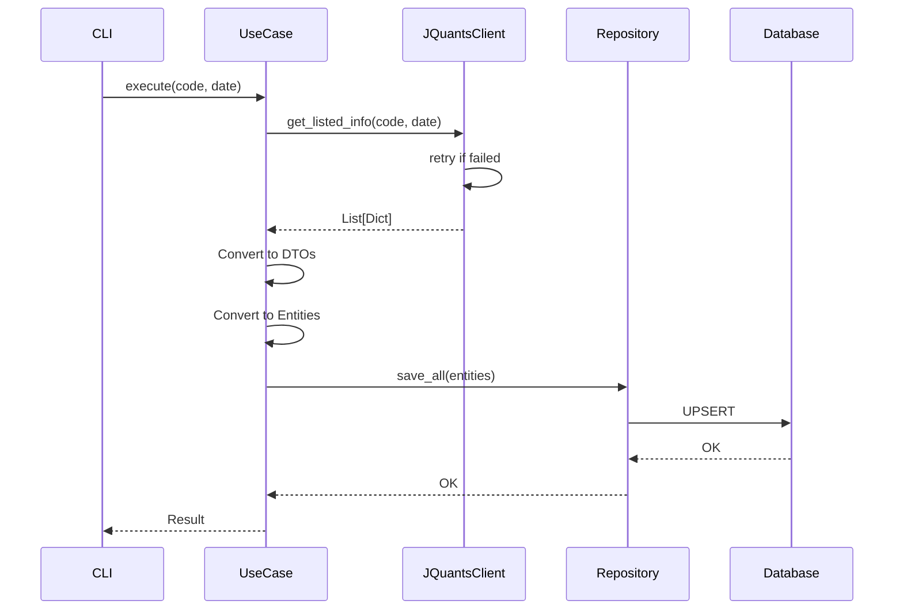

# 上場銘柄一覧（listed_info）データ取得・格納機能 設計書

## 1. アーキテクチャ概要

クリーンアーキテクチャに準拠し、以下の層で構成する：

```
┌─────────────────────────────────────────────────────────────┐
│                    Presentation Layer                        │
│                 (CLI Commands / API Endpoints)               │
├─────────────────────────────────────────────────────────────┤
│                    Application Layer                         │
│                    (Use Cases / DTOs)                        │
├─────────────────────────────────────────────────────────────┤
│                      Domain Layer                            │
│              (Entities / Value Objects / Interfaces)         │
├─────────────────────────────────────────────────────────────┤
│                  Infrastructure Layer                        │
│            (API Clients / DB Repositories)                   │
└─────────────────────────────────────────────────────────────┘
```

## 2. 詳細設計

### 2.1 Domain Layer

#### 2.1.1 Entity
```python
# app/domain/entities/listed_info.py
@dataclass(frozen=True)
class ListedInfo:
    """上場銘柄情報エンティティ"""
    date: date
    code: StockCode
    company_name: str
    company_name_english: Optional[str]
    sector_17_code: Optional[str]
    sector_17_code_name: Optional[str]
    sector_33_code: Optional[str]
    sector_33_code_name: Optional[str]
    scale_category: Optional[str]
    market_code: Optional[str]
    market_code_name: Optional[str]
    margin_code: Optional[str]
    margin_code_name: Optional[str]
```

#### 2.1.2 Repository Interface
```python
# app/domain/repositories/listed_info_repository.py
class ListedInfoRepository(ABC):
    @abstractmethod
    async def save_all(self, listed_infos: List[ListedInfo]) -> None:
        """複数の上場銘柄情報を保存"""
        pass
    
    @abstractmethod
    async def find_by_code_and_date(self, code: StockCode, date: date) -> Optional[ListedInfo]:
        """銘柄コードと日付で検索"""
        pass
    
    @abstractmethod
    async def find_all_by_date(self, date: date) -> List[ListedInfo]:
        """日付で全銘柄を検索"""
        pass
```

### 2.2 Application Layer

#### 2.2.1 Use Case
```python
# app/application/use_cases/fetch_listed_info.py
class FetchListedInfoUseCase:
    def __init__(
        self,
        jquants_client: JQuantsClientInterface,
        listed_info_repository: ListedInfoRepository,
        logger: Logger
    ):
        self._jquants_client = jquants_client
        self._listed_info_repository = listed_info_repository
        self._logger = logger
    
    async def execute(
        self, 
        code: Optional[str] = None, 
        target_date: Optional[date] = None
    ) -> FetchListedInfoResult:
        """上場銘柄情報を取得して保存"""
        # 1. API から情報取得
        # 2. エンティティに変換
        # 3. DB に保存
        # 4. 結果を返す
```

#### 2.2.2 DTO
```python
# app/application/dtos/listed_info_dto.py
@dataclass(frozen=True)
class ListedInfoDTO:
    date: str
    code: str
    company_name: str
    company_name_english: Optional[str]
    # ... 他のフィールド
    
    @classmethod
    def from_api_response(cls, data: Dict[str, Any]) -> "ListedInfoDTO":
        """API レスポンスから DTO を作成"""
        pass
    
    def to_entity(self) -> ListedInfo:
        """エンティティに変換"""
        pass
```

### 2.3 Infrastructure Layer

#### 2.3.1 API Client Extension
```python
# app/infrastructure/jquants/client_extensions.py
class JQuantsListedInfoClient:
    def __init__(self, base_client: BaseJQuantsClient):
        self._client = base_client
    
    async def get_listed_info(
        self,
        code: Optional[str] = None,
        date: Optional[str] = None
    ) -> List[Dict[str, Any]]:
        """上場銘柄情報を取得"""
        params = {}
        if code:
            params["code"] = code
        if date:
            params["date"] = date
        
        response = await self._client.get("/listed/info", params=params)
        return response.get("info", [])
```

#### 2.3.2 Database Repository
```python
# app/infrastructure/database/repositories/listed_info_repository_impl.py
class ListedInfoRepositoryImpl(ListedInfoRepository):
    def __init__(self, db_session: AsyncSession):
        self._session = db_session
    
    async def save_all(self, listed_infos: List[ListedInfo]) -> None:
        """バルク UPSERT 実装"""
        # PostgreSQL の ON CONFLICT 句を使用
        pass
```

#### 2.3.3 Database Model
```python
# app/infrastructure/database/models/listed_info_model.py
class ListedInfoModel(Base):
    __tablename__ = "listed_info"
    
    date = Column(Date, primary_key=True)
    code = Column(String(4), primary_key=True)
    company_name = Column(String(255), nullable=False)
    company_name_english = Column(String(255))
    sector_17_code = Column(String(10))
    sector_17_code_name = Column(String(255))
    sector_33_code = Column(String(10))
    sector_33_code_name = Column(String(255))
    scale_category = Column(String(50))
    market_code = Column(String(10))
    market_code_name = Column(String(50))
    margin_code = Column(String(10))
    margin_code_name = Column(String(50))
    created_at = Column(DateTime, default=func.now())
    updated_at = Column(DateTime, default=func.now(), onupdate=func.now())
    
    __table_args__ = (
        PrimaryKeyConstraint('date', 'code'),
        Index('idx_listed_info_code', 'code'),
        Index('idx_listed_info_date', 'date'),
    )
```

### 2.4 エラーハンドリング

#### 2.4.1 カスタム例外
```python
# app/domain/exceptions/listed_info_exceptions.py
class ListedInfoError(Exception):
    """上場銘柄情報関連の基底例外"""
    pass

class ListedInfoAPIError(ListedInfoError):
    """API 通信エラー"""
    pass

class ListedInfoDataError(ListedInfoError):
    """データ形式エラー"""
    pass
```

#### 2.4.2 リトライ機構
```python
# app/infrastructure/jquants/retry_client.py
class RetryableJQuantsClient:
    def __init__(self, client: JQuantsListedInfoClient, max_retries: int = 3):
        self._client = client
        self._max_retries = max_retries
    
    async def get_listed_info_with_retry(self, **kwargs) -> List[Dict[str, Any]]:
        """リトライ付きで API を呼び出し"""
        for attempt in range(self._max_retries):
            try:
                return await self._client.get_listed_info(**kwargs)
            except Exception as e:
                if attempt == self._max_retries - 1:
                    raise
                await asyncio.sleep(2 ** attempt)  # 指数バックオフ
```

## 3. データフロー



## 4. テスト戦略

### 4.1 ユニットテスト
- Entity: バリデーションロジックのテスト
- UseCase: モックを使用したビジネスロジックのテスト
- DTO: 変換ロジックのテスト
- Repository: モック DB を使用した CRUD 操作のテスト

### 4.2 統合テスト
- API Client: VCR を使用した実 API との通信テスト
- Database: テスト用 DB を使用した実際の DB 操作テスト

### 4.3 E2E テスト
- CLI コマンドの実行から結果確認までの一連の流れ

## 5. マイグレーション

```sql
-- migrations/versions/xxx_create_listed_info_table.py
CREATE TABLE listed_info (
    date DATE NOT NULL,
    code VARCHAR(4) NOT NULL,
    company_name VARCHAR(255) NOT NULL,
    company_name_english VARCHAR(255),
    sector_17_code VARCHAR(10),
    sector_17_code_name VARCHAR(255),
    sector_33_code VARCHAR(10),
    sector_33_code_name VARCHAR(255),
    scale_category VARCHAR(50),
    market_code VARCHAR(10),
    market_code_name VARCHAR(50),
    margin_code VARCHAR(10),
    margin_code_name VARCHAR(50),
    created_at TIMESTAMP DEFAULT CURRENT_TIMESTAMP,
    updated_at TIMESTAMP DEFAULT CURRENT_TIMESTAMP,
    PRIMARY KEY (date, code)
);

CREATE INDEX idx_listed_info_code ON listed_info(code);
CREATE INDEX idx_listed_info_date ON listed_info(date);
```

## 6. 設定

```python
# app/core/config.py に追加
class Settings(BaseSettings):
    # 既存の設定...
    
    # Listed Info 設定
    LISTED_INFO_BATCH_SIZE: int = 1000  # バッチ処理のサイズ
    LISTED_INFO_RETRY_COUNT: int = 3    # リトライ回数
    LISTED_INFO_RETRY_DELAY: int = 2    # リトライ間隔（秒）
```