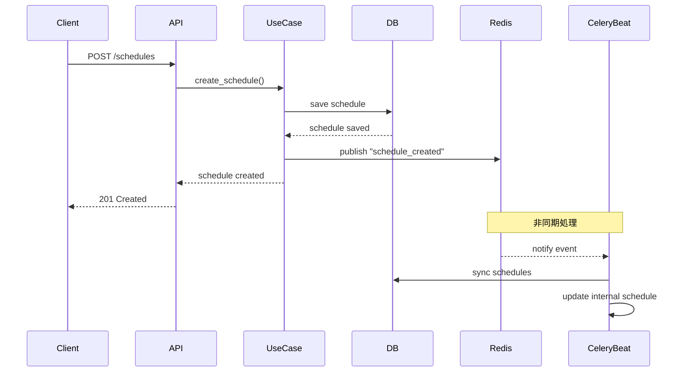

# 設計書: スケジュールタスクのタイムアウト問題の解決

## 1. アーキテクチャ概要

### 現在の構造
```
┌─────────────────┐     ┌──────────────────┐     ┌─────────────────┐
│  FastAPI App    │     │  Celery Beat     │     │  PostgreSQL     │
│                 │     │                  │     │                 │
│ POST /schedules │────>│ DatabaseScheduler │<────│ schedules table │
│                 │     │ (60 秒ごとに同期) │     │                 │
└─────────────────┘     └──────────────────┘     └─────────────────┘
```

### 改善後の構造
```
┌─────────────────┐     ┌──────────────────┐     ┌─────────────────┐
│  FastAPI App    │     │  Celery Beat     │     │  PostgreSQL     │
│                 │     │                  │     │                 │
│ POST /schedules │────>│ DatabaseScheduler │<────│ schedules table │
│       │         │     │                  │     │                 │
│       ▼         │     │                  │     └─────────────────┘
│  Redis Pub/Sub  │────>│ Event Listener   │
│                 │     │ (即時同期)       │
└─────────────────┘     └──────────────────┘
```

## 2. コンポーネント設計

### 2.1 Redis Pub/Sub による通知機構

#### ScheduleEventPublisher (新規)
```python
class ScheduleEventPublisher:
    """スケジュールイベントを Redis に通知"""
    
    def __init__(self, redis_client: Redis):
        self.redis = redis_client
        self.channel = "celery_beat_schedule_updates"
    
    async def publish_schedule_created(self, schedule_id: str):
        """スケジュール作成イベントを発行"""
        event = {
            "event_type": "schedule_created",
            "schedule_id": schedule_id,
            "timestamp": datetime.utcnow().isoformat()
        }
        await self.redis.publish(self.channel, json.dumps(event))
    
    async def publish_schedule_updated(self, schedule_id: str):
        """スケジュール更新イベントを発行"""
        # 同様の実装
    
    async def publish_schedule_deleted(self, schedule_id: str):
        """スケジュール削除イベントを発行"""
        # 同様の実装
```

### 2.2 DatabaseSchedulerAsyncPG の拡張

#### 主な変更点：
1. Redis Subscriber スレッドの追加
2. イベント受信時の即時同期
3. 同期処理の最適化

```python
class DatabaseSchedulerAsyncPG(Scheduler):
    def __init__(self, *args, **kwargs):
        super().__init__(*args, **kwargs)
        self._redis_subscriber_thread = None
        self._start_redis_subscriber()
    
    def _start_redis_subscriber(self):
        """Redis イベントリスナーを別スレッドで起動"""
        self._redis_subscriber_thread = threading.Thread(
            target=self._redis_subscriber_worker,
            daemon=True
        )
        self._redis_subscriber_thread.start()
    
    def _redis_subscriber_worker(self):
        """Redis イベントを監視して同期をトリガー"""
        redis_client = Redis.from_url(settings.redis_url)
        pubsub = redis_client.pubsub()
        pubsub.subscribe("celery_beat_schedule_updates")
        
        for message in pubsub.listen():
            if message['type'] == 'message':
                self._handle_schedule_event(message['data'])
    
    def _handle_schedule_event(self, data):
        """スケジュールイベントを処理"""
        event = json.loads(data)
        logger.info(f"Received schedule event: {event['event_type']}")
        # 即座に同期を実行
        self.sync_schedules()
```

### 2.3 ManageListedInfoScheduleUseCase の拡張

```python
class ManageListedInfoScheduleUseCase:
    def __init__(
        self,
        schedule_repository: ScheduleRepositoryInterface,
        event_publisher: ScheduleEventPublisher  # 新規追加
    ):
        self._schedule_repository = schedule_repository
        self._event_publisher = event_publisher
    
    async def create_schedule(self, ...):
        # 既存の処理
        saved_schedule = await self._schedule_repository.save(schedule)
        
        # イベント発行を追加
        await self._event_publisher.publish_schedule_created(
            str(saved_schedule.id)
        )
        
        return saved_schedule
```

## 3. データフロー

### スケジュール作成時のフロー



## 4. 実装の考慮事項

### 4.1 エラーハンドリング
- Redis 接続エラー時は、通知を送信せずに処理を継続（既存の 60 秒同期に依存）
- イベント処理エラー時は、ログを記録して処理を継続

### 4.2 パフォーマンス
- 同期処理の重複を防ぐため、短時間での連続同期をスキップする仕組みを実装
- 最小同期間隔: 5 秒

### 4.3 後方互換性
- Redis が利用できない環境では、従来の 60 秒同期のみで動作
- 環境変数で機能の有効/無効を切り替え可能

## 5. 設定

### 環境変数
```bash
# Redis Pub/Sub 機能の有効化
CELERY_BEAT_REDIS_SYNC_ENABLED=true

# 最小同期間隔（秒）
CELERY_BEAT_MIN_SYNC_INTERVAL=5

# Redis チャンネル名
CELERY_BEAT_REDIS_CHANNEL=celery_beat_schedule_updates
```

### 依存関係の注入
```python
# FastAPI の依存関係設定
def get_schedule_event_publisher() -> ScheduleEventPublisher:
    if settings.celery_beat_redis_sync_enabled:
        redis_client = get_redis_client()
        return ScheduleEventPublisher(redis_client)
    return None  # 無効時は None を返す
```

## 6. テスト戦略

### 単体テスト
1. ScheduleEventPublisher のイベント発行テスト
2. DatabaseSchedulerAsyncPG のイベント受信テスト
3. 同期処理の重複防止テスト

### 統合テスト
1. スケジュール作成から実行までの一連のフローテスト
2. Redis 接続エラー時のフォールバックテスト
3. 高負荷時の動作テスト

### エンドツーエンドテスト
1. `test_scheduled_listed_info_api.py` の成功確認
2. 複数スケジュール同時作成時のテスト

## 7. 移行計画

### フェーズ 1: 基盤実装
1. ScheduleEventPublisher の実装
2. Redis 接続の設定

### フェーズ 2: Celery Beat 拡張
1. DatabaseSchedulerAsyncPG へのイベントリスナー追加
2. 同期処理の最適化

### フェーズ 3: API 統合
1. UseCase へのイベント発行追加
2. 依存関係の設定

### フェーズ 4: テストと検証
1. 各種テストの実行
2. パフォーマンス検証

## 8. 期待される効果

1. **即時反映**: スケジュール作成後、数秒以内にタスクが実行可能
2. **テストの安定化**: タイムアウトエラーの解消
3. **ユーザー体験の向上**: スケジュール設定後すぐに動作確認が可能
4. **システムの効率化**: 必要な時のみ同期を実行