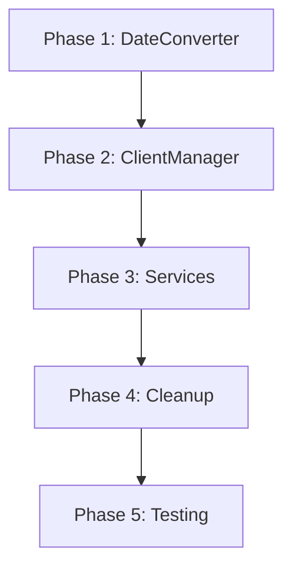

# JQuantsクライアントラッパーのリファクタリング実装計画

## Phase 1: DateConverterユーティリティの作成とテスト（推定時間：30分）

### 1.1 実装タスク
1. `app/utils/date_converter.py`ファイルを作成
2. `DateConverter`クラスを実装
   - `to_date()`メソッド：様々な日付形式をdateオブジェクトに変換
   - `to_yyyymmdd_string()`メソッド：dateオブジェクトをYYYYMMDD形式の文字列に変換
   - `to_iso_string()`メソッド：dateオブジェクトをYYYY-MM-DD形式の文字列に変換

### 1.2 テストタスク
1. `tests/unit/utils/test_date_converter.py`を作成
2. 各種日付形式の変換テストを実装
   - YYYYMMDD形式の文字列
   - YYYY-MM-DD形式の文字列
   - datetimeオブジェクト
   - dateオブジェクト
   - None値
   - 不正な形式のエラーケース

## Phase 2: JQuantsClientManagerのリファクタリング（推定時間：1時間）

### 2.1 実装タスク
1. `JQuantsClientManager`クラスの修正
   - `_listed_clients`と`_daily_quotes_clients`の削除
   - `get_client()`メソッドを`IAPIClient`を返すよう修正
   - `get_daily_quotes_client()`メソッドを削除（または`get_client()`のエイリアスに）
   - キャッシュクリアメソッドの簡素化

### 2.2 テストタスク
1. 既存のテストの修正
2. モックの調整（ラッパークラスではなくIAPIClientを直接モック）

## Phase 3: サービスクラスの修正（推定時間：2時間）

### 3.1 CompanyDataFetcherの修正
1. インポート文の更新
2. `fetch_all_companies()`メソッドの修正
   - `get_client()`を使用してIAPIClientを直接取得
   - 日付変換にDateConverterを使用

### 3.2 DailyQuotesDataFetcherの修正
1. インポート文の更新
2. 各fetchメソッドの修正
   - `get_client()`を使用してIAPIClientを直接取得
   - 日付変換にDateConverterを使用
   - レスポンス形式の調整（ページネーション情報の処理）

### 3.3 テストの更新
1. `test_company_data_fetcher.py`の修正
2. `test_daily_quotes_data_fetcher.py`の修正

## Phase 4: ラッパークラスの削除（推定時間：30分）

### 4.1 削除タスク
1. `JQuantsListedInfoClient`クラスの削除
2. `JQuantsDailyQuotesClient`クラスの削除
3. 関連するインポート文の削除

### 4.2 リファクタリング
1. `jquants_client.py`ファイルの整理
2. 不要なコメントやドキュメントの削除

## Phase 5: 統合テストと検証（推定時間：1時間）

### 5.1 統合テスト
1. `test_company_sync_service_integration.py`の実行と確認
2. `test_daily_quotes_sync_service.py`の実行と確認

### 5.2 リグレッションテスト
1. 全テストスイートの実行
   ```bash
   make test-docker
   ```

### 5.3 手動検証
1. CompanySyncServiceの動作確認
   - 企業データの同期が正常に動作することを確認
2. DailyQuotesSyncServiceの動作確認
   - 株価データの同期が正常に動作することを確認

## 実装順序と依存関係



## リスクと対策

### リスク1: 既存機能の破壊
**対策**: 各フェーズごとにテストを実行し、問題があれば即座に修正

### リスク2: 日付変換の不整合
**対策**: DateConverterの実装を慎重に行い、包括的なテストを作成

### リスク3: APIレスポンス形式の不一致
**対策**: 既存のレスポンス形式を維持し、必要に応じて変換処理を追加

## チェックリスト

- [ ] Phase 1: DateConverterの実装とテスト
  - [ ] DateConverterクラスの作成
  - [ ] 単体テストの作成と実行
  - [ ] すべてのテストが成功

- [ ] Phase 2: JQuantsClientManagerのリファクタリング
  - [ ] クラスの修正
  - [ ] テストの更新
  - [ ] 既存テストが成功

- [ ] Phase 3: サービスクラスの修正
  - [ ] CompanyDataFetcherの修正
  - [ ] DailyQuotesDataFetcherの修正
  - [ ] 各サービスのテスト更新
  - [ ] すべてのテストが成功

- [ ] Phase 4: ラッパークラスの削除
  - [ ] 不要なクラスの削除
  - [ ] インポート文の整理
  - [ ] ファイルの整理

- [ ] Phase 5: 統合テストと検証
  - [ ] 統合テストの実行
  - [ ] リグレッションテストの実行
  - [ ] 手動動作確認
  - [ ] すべてのテストが成功

## 総推定時間: 約5時間

実際の作業時間は、既存コードの複雑さやテストの状況によって変動する可能性があります。