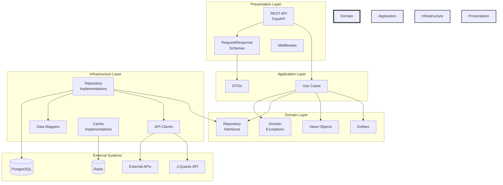

# クリーンアーキテクチャ レイヤー構成図

## レイヤー間の依存関係



## データフローの例（銘柄情報取得）

```
┌─────────────────────────────────────────────────────────────────┐
│ 1. HTTP Request                                                 │
│    GET /api/v1/stocks/7203                                      │
└────────────────────┬────────────────────────────────────────────┘
                     │
                     ▼
┌─────────────────────────────────────────────────────────────────┐
│ 2. Presentation Layer (FastAPI Endpoint)                        │
│    - リクエストの検証                                           │
│    - 認証チェック                                              │
│    - UseCase の呼び出し                                        │
└────────────────────┬────────────────────────────────────────────┘
                     │
                     ▼
┌─────────────────────────────────────────────────────────────────┐
│ 3. Application Layer (StockUseCase)                            │
│    - ビジネスロジックの実行                                    │
│    - Repository インターフェースの使用                         │
│    - エラーハンドリング                                        │
└────────────────────┬────────────────────────────────────────────┘
                     │
                     ▼
┌─────────────────────────────────────────────────────────────────┐
│ 4. Domain Layer                                                │
│    - エンティティの操作                                        │
│    - ビジネスルールの適用                                      │
│    - バリデーション                                            │
└────────────────────┬────────────────────────────────────────────┘
                     │
                     ▼
┌─────────────────────────────────────────────────────────────────┐
│ 5. Infrastructure Layer (StockRepositoryImpl)                  │
│    - キャッシュチェック                                        │
│    - J-Quants API 呼び出し                                     │
│    - データマッピング                                          │
└────────────────────┬────────────────────────────────────────────┘
                     │
                     ▼
┌─────────────────────────────────────────────────────────────────┐
│ 6. External System (J-Quants API)                              │
│    - 実際のデータ取得                                          │
└─────────────────────────────────────────────────────────────────┘
```

## 主要コンポーネントの責務

### Domain Layer（中心）
- **完全に独立**: 他のレイヤーに依存しない
- **ビジネスルール**: 企業の中核的なビジネスルール
- **エンティティ**: ビジネスオブジェクト
- **インターフェース定義**: リポジトリの抽象

### Application Layer
- **ユースケース**: アプリケーション固有のビジネスルール
- **調整役**: ドメイン層とインフラ層の調整
- **トランザクション管理**: ビジネス操作の単位
- **例外変換**: ドメイン例外をアプリケーション例外に

### Infrastructure Layer
- **技術的詳細**: データベース、外部 API 、ファイルシステム
- **実装**: リポジトリインターフェースの具体的な実装
- **データ変換**: 外部形式とドメインモデル間の変換
- **外部サービス統合**: サードパーティライブラリの使用

### Presentation Layer
- **ユーザーインターフェース**: REST API 、 GraphQL 、 CLI
- **入出力変換**: HTTP リクエスト/レスポンスの処理
- **認証・認可**: セキュリティの実装
- **エラー表現**: ユーザー向けエラーメッセージ

## 依存性の方向

```
Presentation → Application → Domain ← Infrastructure
```

- 依存性は常に内側（Domain）に向かう
- Domain 層は他のレイヤーを知らない
- Infrastructure 層は Domain 層のインターフェースを実装
- Application 層は Domain 層を使用し、 Infrastructure 層の実装に依存しない（DI 使用）

## 実装済みコンポーネントの関係

```
┌─────────────────────────────────────────────────────────────┐
│                        Domain Layer                          │
├─────────────────────────────────────────────────────────────┤
│  Entities:                    Repository Interfaces:        │
│  - JQuantsCredentials         - AuthRepository             │
│  - Stock, StockList          - StockRepository            │
│  - RefreshToken, IdToken                                   │
│                                                            │
│  Exceptions:                                               │
│  - AuthenticationError                                     │
│  - NetworkError                                            │
│  - ValidationError                                         │
└─────────────────────────────────────────────────────────────┘
                               ▲
                               │
┌─────────────────────────────────────────────────────────────┐
│                    Application Layer                        │
├─────────────────────────────────────────────────────────────┤
│  Use Cases:                                                │
│  - AuthUseCase                                             │
│    ・ authenticate()                                        │
│    ・ refresh_token()                                       │
│  - StockUseCase                                            │
│    ・ get_all_stocks()                                      │
│    ・ search_stocks()                                       │
└─────────────────────────────────────────────────────────────┘
                               ▲
                               │
┌─────────────────────────────────────────────────────────────┐
│                  Infrastructure Layer                       │
├─────────────────────────────────────────────────────────────┤
│  Implementations:                                          │
│  - JQuantsAuthRepository                                   │
│  - JQuantsStockRepository                                  │
│  - JQuantsBaseClient                                       │
│                                                            │
│  External Integration:                                     │
│  - J-Quants API (/token/auth_user, /listed/info)         │
│  - File System Cache                                       │
└─────────────────────────────────────────────────────────────┘
```