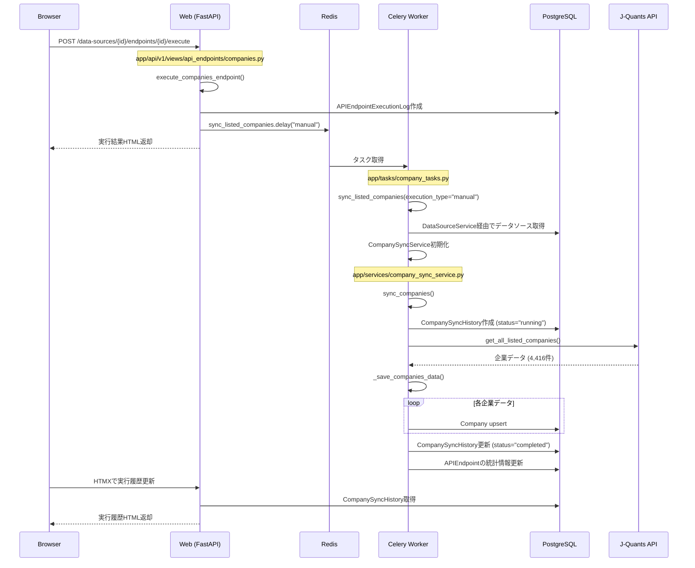
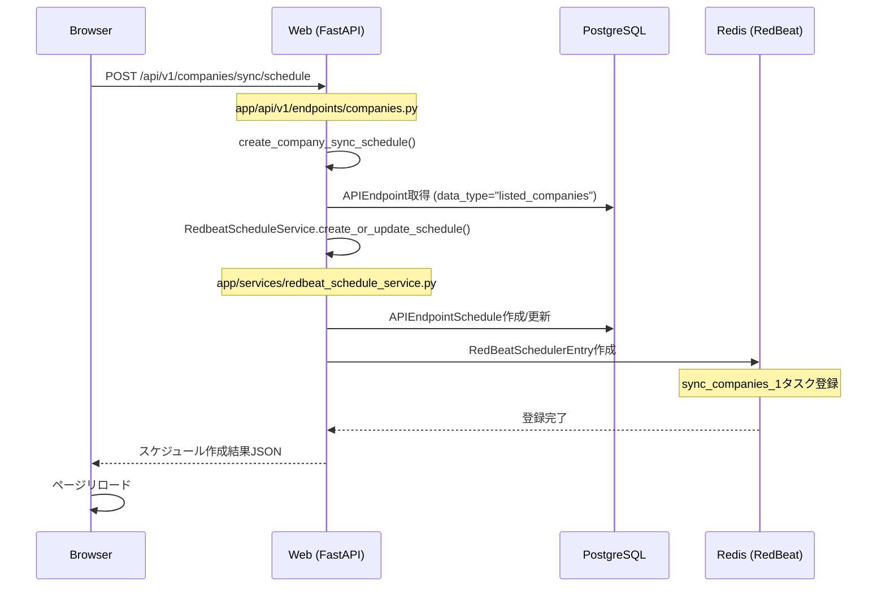
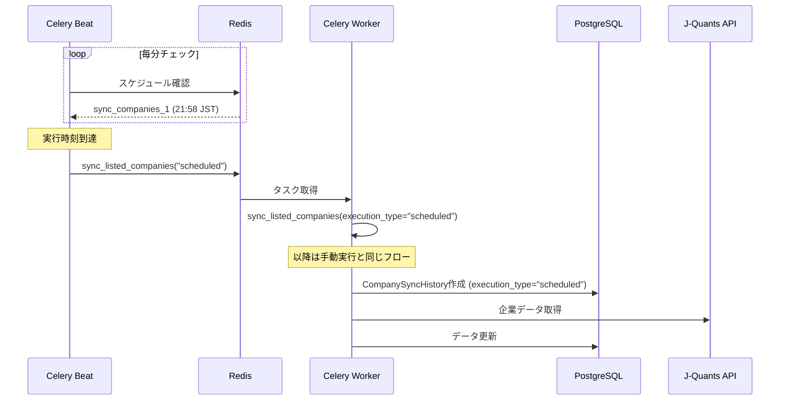
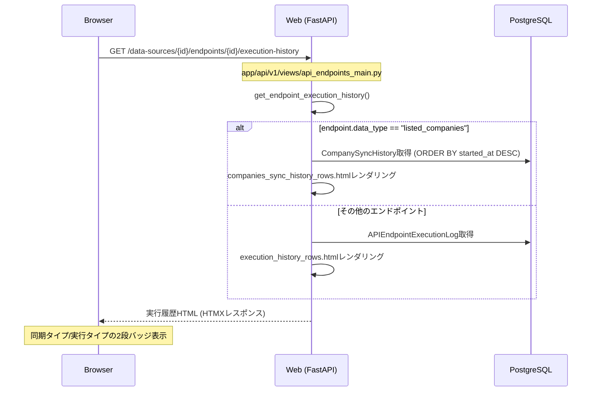
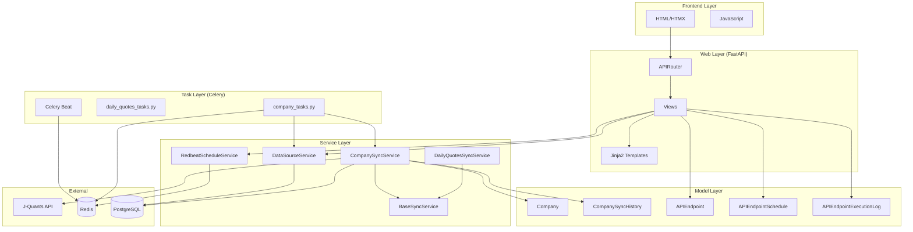

# Stockura アーキテクチャ図 - 処理フロー

## 1. 手動同期実行フロー（上場企業一覧）

## 2. 定期実行スケジュール設定フロー

## 3. 定期実行フロー（Celery Beat）

## 4. 実行履歴表示フロー

## 5. コンポーネント関係図

## 6. ファイル構成と責務

### Web層
- `app/api/v1/views/api_endpoints_main.py` - メインルーター、共通処理
- `app/api/v1/views/api_endpoints/companies.py` - 企業エンドポイント固有処理
- `app/api/v1/endpoints/companies.py` - 企業API（同期実行、スケジュール管理）

### サービス層
- `app/services/base_sync_service.py` - 同期サービス基底クラス
- `app/services/company_sync_service.py` - 企業データ同期ロジック
- `app/services/redbeat_schedule_service.py` - スケジュール管理

### タスク層
- `app/tasks/company_tasks.py` - 企業同期Celeryタスク
- `app/core/celery_app.py` - Celery設定

### モデル層
- `app/models/company.py` - Company, CompanySyncHistory
- `app/models/api_endpoint.py` - APIEndpoint, APIEndpointSchedule, APIEndpointExecutionLog

### テンプレート層
- `app/templates/partials/api_endpoints/endpoint_details_companies.html` - 企業詳細画面
- `app/templates/partials/api_endpoints/companies_sync_history_rows.html` - 実行履歴行

## 7. データフロー

1. **ユーザー操作** → HTMX → FastAPI View
2. **View** → Service層（ビジネスロジック）
3. **Service** → Celeryタスク（非同期実行）
4. **Celeryタスク** → 外部API/DB操作
5. **結果** → DB保存 → HTMX更新 → 画面反映

## 8. 重要な処理ポイント

### execution_typeの流れ
1. 手動実行: `sync_listed_companies.delay("manual")`
2. 定期実行: Celery Beatが`sync_listed_companies("scheduled")`を実行
3. タスク内で`CompanySyncService.sync_companies(execution_type=...)`
4. `CompanySyncHistory`に`execution_type`が記録される
5. 実行履歴画面で2段バッジ（sync_type/execution_type）として表示

### スケジュール管理
1. `APIEndpointSchedule` - DB上のスケジュール設定
2. `RedBeatSchedulerEntry` - Redis上のCelery Beat用エントリ
3. 両者を`RedbeatScheduleService`が同期管理