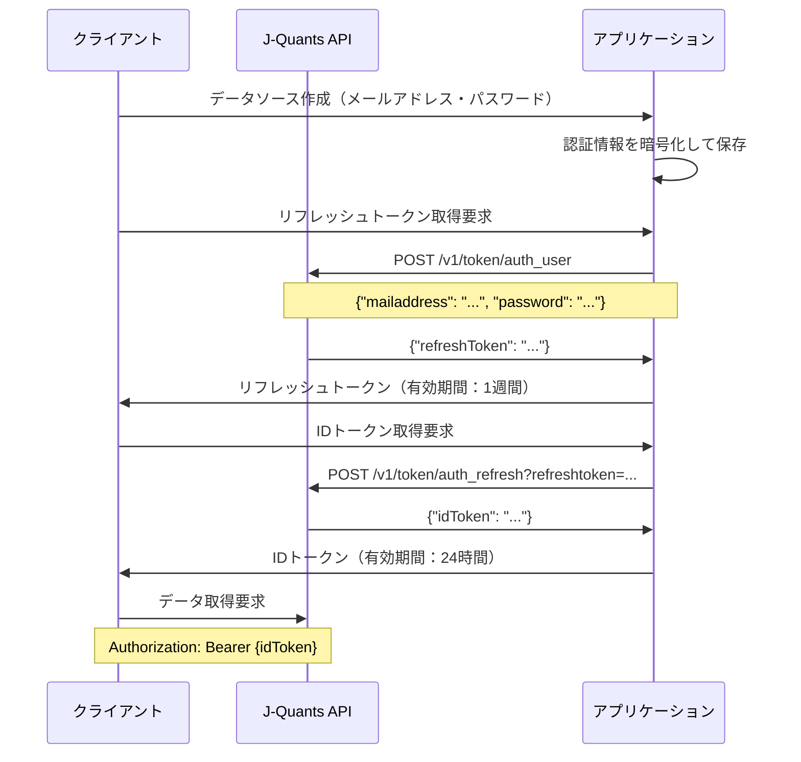

# J-Quants API認証機構実装方針

## 概要

J-Quants APIの認証機構は、2段階のトークン認証システムを採用しています。このドキュメントでは、リフレッシュトークンとIDトークンの取得・管理に関する実装方針を詳しく説明します。

## 認証フロー概要



## API仕様詳細

### 1. リフレッシュトークン取得 (`/token/auth_user`)

#### エンドポイント
- **URL**: `POST https://api.jquants.com/v1/token/auth_user`
- **認証方式**: メールアドレス・パスワード認証
- **有効期間**: **1週間（7日間）**

#### リクエスト仕様
```json
{
    "mailaddress": "your-email@example.com",
    "password": "your-password"
}
```

#### レスポンス仕様

**成功時 (200 OK)**:
```json
{
    "refreshToken": "your-refresh-token"
}
```

**エラー時**:
- `400 Bad Request`: パラメータ不足
- `403 Forbidden`: 認証失敗（メールアドレスまたはパスワードが不正）
- `500 Internal Server Error`: サーバー内部エラー

#### エラーレスポンス例
```json
{
    "message": "'mailaddress' or 'password' is incorrect."
}
```

### 2. IDトークン取得 (`/token/auth_refresh`)

#### エンドポイント
- **URL**: `POST https://api.jquants.com/v1/token/auth_refresh`
- **認証方式**: リフレッシュトークン認証
- **有効期間**: **24時間**

#### リクエスト仕様
- **クエリパラメータ**: `refreshtoken=your-refresh-token`
- **ヘッダー**: 不要
- **ボディ**: 不要

#### レスポンス仕様

**成功時 (200 OK)**:
```json
{
    "idToken": "your-id-token"
}
```

**エラー時**:
- `400 Bad Request`: リフレッシュトークンが不足
- `403 Forbidden`: 無効なリフレッシュトークン
- `500 Internal Server Error`: サーバー内部エラー

## 実装方針

### 1. 認証ストラテジーの修正

#### 1.1 JQuantsStrategyクラスの修正

**修正前の問題点**:
- リフレッシュトークンの有効期間が24時間（正しくは1週間）
- IDトークンの有効期間が1時間（正しくは24時間）
- IDトークン取得時にAuthorizationヘッダーを使用（正しくはクエリパラメータ）

**修正後の実装**:
```python
class JQuantsStrategy(AuthStrategy):
    def get_refresh_token(self, credentials: Dict[str, Any]) -> Tuple[Optional[str], Optional[datetime]]:
        """リフレッシュトークン取得（有効期間：1週間）"""
        try:
            with httpx.Client() as client:
                response = client.post(
                    f"{self.base_url}/v1/token/auth_user",
                    json={
                        "mailaddress": credentials["mailaddress"],
                        "password": credentials["password"]
                    }
                )
                response.raise_for_status()
                refresh_token = response.json()["refreshToken"]
                
                # 有効期限は1週間（7日間）
                expired_at = datetime.utcnow() + timedelta(days=7)
                return refresh_token, expired_at
        except Exception as e:
            print(f"Error getting refresh token: {e}")
            return None, None

    def get_id_token(self, refresh_token: str) -> Tuple[Optional[str], Optional[datetime]]:
        """IDトークン取得（有効期間：24時間）"""
        try:
            with httpx.Client() as client:
                # クエリパラメータでリフレッシュトークンを送信
                response = client.post(
                    f"{self.base_url}/v1/token/auth_refresh?refreshtoken={refresh_token}"
                )
                response.raise_for_status()
                id_token = response.json()["idToken"]
                
                # 有効期限は24時間
                expired_at = datetime.utcnow() + timedelta(hours=24)
                return id_token, expired_at
        except Exception as e:
            print(f"Error getting ID token: {e}")
            return None, None
```

### 2. トークン管理機能の実装

#### 2.1 TokenManagerクラス

```python
from datetime import datetime, timedelta
from typing import Dict, Optional, Tuple
import asyncio

class TokenManager:
    """トークンの管理を行うクラス"""
    
    def __init__(self):
        self.refresh_tokens: Dict[int, Tuple[str, datetime]] = {}
        self.id_tokens: Dict[int, Tuple[str, datetime]] = {}
        self._lock = asyncio.Lock()
    
    async def get_valid_refresh_token(self, data_source_id: int) -> Optional[str]:
        """有効なリフレッシュトークンを取得"""
        async with self._lock:
            if data_source_id in self.refresh_tokens:
                token, expired_at = self.refresh_tokens[data_source_id]
                if datetime.utcnow() < expired_at:
                    return token
            return None
    
    async def get_valid_id_token(self, data_source_id: int) -> Optional[str]:
        """有効なIDトークンを取得"""
        async with self._lock:
            if data_source_id in self.id_tokens:
                token, expired_at = self.id_tokens[data_source_id]
                if datetime.utcnow() < expired_at:
                    return token
            return None
    
    async def store_refresh_token(self, data_source_id: int, token: str, expired_at: datetime):
        """リフレッシュトークンを保存"""
        async with self._lock:
            self.refresh_tokens[data_source_id] = (token, expired_at)
    
    async def store_id_token(self, data_source_id: int, token: str, expired_at: datetime):
        """IDトークンを保存"""
        async with self._lock:
            self.id_tokens[data_source_id] = (token, expired_at)
    
    async def clear_tokens(self, data_source_id: int):
        """指定されたデータソースのトークンを削除"""
        async with self._lock:
            self.refresh_tokens.pop(data_source_id, None)
            self.id_tokens.pop(data_source_id, None)
```

#### 2.2 AutoTokenRefreshクラス

```python
class AutoTokenRefresh:
    """トークンの自動更新を行うクラス"""
    
    def __init__(self, token_manager: TokenManager, data_source_service):
        self.token_manager = token_manager
        self.data_source_service = data_source_service
    
    async def ensure_valid_id_token(self, data_source_id: int) -> Optional[str]:
        """有効なIDトークンを保証（必要に応じて更新）"""
        # 既存のIDトークンをチェック
        id_token = await self.token_manager.get_valid_id_token(data_source_id)
        if id_token:
            return id_token
        
        # IDトークンが無効または期限切れの場合、リフレッシュトークンから取得
        refresh_token = await self.token_manager.get_valid_refresh_token(data_source_id)
        if not refresh_token:
            # リフレッシュトークンも無効な場合、新しく取得
            refresh_token = await self._get_new_refresh_token(data_source_id)
            if not refresh_token:
                return None
        
        # リフレッシュトークンからIDトークンを取得
        id_token = await self._get_new_id_token(data_source_id, refresh_token)
        return id_token
    
    async def _get_new_refresh_token(self, data_source_id: int) -> Optional[str]:
        """新しいリフレッシュトークンを取得"""
        try:
            data_source = await self.data_source_service.get_data_source(data_source_id)
            if not data_source:
                return None
            
            strategy = StrategyRegistry.get_strategy(data_source.provider_type)()
            credentials = data_source.get_credentials()
            
            if not credentials:
                return None
            
            token, expired_at = strategy.get_refresh_token(credentials)
            if token and expired_at:
                await self.token_manager.store_refresh_token(data_source_id, token, expired_at)
                return token
        except Exception as e:
            print(f"Error getting new refresh token: {e}")
        return None
    
    async def _get_new_id_token(self, data_source_id: int, refresh_token: str) -> Optional[str]:
        """新しいIDトークンを取得"""
        try:
            data_source = await self.data_source_service.get_data_source(data_source_id)
            if not data_source:
                return None
            
            strategy = StrategyRegistry.get_strategy(data_source.provider_type)()
            token, expired_at = strategy.get_id_token(refresh_token)
            
            if token and expired_at:
                await self.token_manager.store_id_token(data_source_id, token, expired_at)
                return token
        except Exception as e:
            print(f"Error getting new ID token: {e}")
        return None
```

### 3. エラーハンドリングの実装

#### 3.1 認証エラーの分類

```python
from enum import Enum

class AuthErrorType(Enum):
    INVALID_CREDENTIALS = "invalid_credentials"
    EXPIRED_TOKEN = "expired_token"
    INVALID_TOKEN = "invalid_token"
    RATE_LIMIT_EXCEEDED = "rate_limit_exceeded"
    SERVER_ERROR = "server_error"
    NETWORK_ERROR = "network_error"

class AuthError(Exception):
    def __init__(self, error_type: AuthErrorType, message: str, status_code: int = None):
        self.error_type = error_type
        self.message = message
        self.status_code = status_code
        super().__init__(message)
```

#### 3.2 エラーハンドリングの実装

```python
def handle_auth_error(response: httpx.Response) -> AuthError:
    """認証エラーを適切に処理"""
    if response.status_code == 400:
        return AuthError(AuthErrorType.INVALID_CREDENTIALS, "Invalid credentials", 400)
    elif response.status_code == 403:
        return AuthError(AuthErrorType.INVALID_TOKEN, "Invalid or expired token", 403)
    elif response.status_code == 429:
        return AuthError(AuthErrorType.RATE_LIMIT_EXCEEDED, "Rate limit exceeded", 429)
    elif response.status_code >= 500:
        return AuthError(AuthErrorType.SERVER_ERROR, "Server error", response.status_code)
    else:
        return AuthError(AuthErrorType.NETWORK_ERROR, "Network error", response.status_code)
```

### 4. セキュリティ考慮事項

#### 4.1 認証情報の暗号化

- メールアドレス・パスワードはAES-256-GCMで暗号化
- 暗号化キーは環境変数で管理
- データベースには暗号化された状態で保存

#### 4.2 トークンの安全な管理

- メモリ内でのトークン保存（永続化しない）
- トークンの有効期限管理
- 期限切れトークンの自動削除

#### 4.3 レート制限の実装

```python
class RateLimiter:
    """API呼び出しのレート制限を管理"""
    
    def __init__(self, max_requests_per_minute: int = 60):
        self.max_requests = max_requests_per_minute
        self.requests = []
    
    async def check_rate_limit(self) -> bool:
        """レート制限をチェック"""
        now = datetime.utcnow()
        # 1分前のリクエストを削除
        self.requests = [req_time for req_time in self.requests 
                        if now - req_time < timedelta(minutes=1)]
        
        if len(self.requests) >= self.max_requests:
            return False
        
        self.requests.append(now)
        return True
```

### 5. ログ出力の実装

#### 5.1 認証ログの構造

```python
import logging
from datetime import datetime

class AuthLogger:
    """認証関連のログを出力"""
    
    def __init__(self):
        self.logger = logging.getLogger("auth")
    
    def log_token_retrieval(self, data_source_id: int, token_type: str, success: bool, error: str = None):
        """トークン取得のログを出力"""
        log_data = {
            "timestamp": datetime.utcnow().isoformat(),
            "data_source_id": data_source_id,
            "token_type": token_type,
            "success": success,
            "error": error
        }
        
        if success:
            self.logger.info(f"Token retrieval successful: {log_data}")
        else:
            self.logger.error(f"Token retrieval failed: {log_data}")
    
    def log_token_expiration(self, data_source_id: int, token_type: str):
        """トークン期限切れのログを出力"""
        log_data = {
            "timestamp": datetime.utcnow().isoformat(),
            "data_source_id": data_source_id,
            "token_type": token_type
        }
        self.logger.warning(f"Token expired: {log_data}")
```

### 6. テスト実装方針

#### 6.1 単体テスト

```python
import pytest
from unittest.mock import Mock, patch

class TestJQuantsStrategy:
    """J-Quants認証ストラテジーのテスト"""
    
    def test_get_refresh_token_success(self):
        """リフレッシュトークン取得成功のテスト"""
        with patch('httpx.Client') as mock_client:
            mock_response = Mock()
            mock_response.json.return_value = {"refreshToken": "test_token"}
            mock_response.raise_for_status.return_value = None
            mock_client.return_value.__enter__.return_value.post.return_value = mock_response
            
            strategy = JQuantsStrategy()
            credentials = {"mailaddress": "test@example.com", "password": "password"}
            token, expired_at = strategy.get_refresh_token(credentials)
            
            assert token == "test_token"
            assert expired_at is not None
    
    def test_get_refresh_token_failure(self):
        """リフレッシュトークン取得失敗のテスト"""
        with patch('httpx.Client') as mock_client:
            mock_response = Mock()
            mock_response.raise_for_status.side_effect = Exception("Auth failed")
            mock_client.return_value.__enter__.return_value.post.return_value = mock_response
            
            strategy = JQuantsStrategy()
            credentials = {"mailaddress": "test@example.com", "password": "wrong_password"}
            token, expired_at = strategy.get_refresh_token(credentials)
            
            assert token is None
            assert expired_at is None
```

#### 6.2 統合テスト

```python
class TestAuthenticationFlow:
    """認証フローの統合テスト"""
    
    @pytest.mark.asyncio
    async def test_complete_authentication_flow(self):
        """完全な認証フローのテスト"""
        # データソース作成
        data_source = await create_test_data_source()
        
        # リフレッシュトークン取得
        refresh_token = await get_refresh_token(data_source.id)
        assert refresh_token is not None
        
        # IDトークン取得
        id_token = await get_id_token(data_source.id, refresh_token)
        assert id_token is not None
        
        # トークンの有効性確認
        assert await validate_token(id_token)
```

### 7. 運用監視

#### 7.1 監視メトリクス

```python
class AuthMetrics:
    """認証関連のメトリクスを収集"""
    
    def __init__(self):
        self.token_retrieval_success = 0
        self.token_retrieval_failure = 0
        self.token_expiration_count = 0
    
    def record_token_retrieval(self, success: bool):
        """トークン取得の結果を記録"""
        if success:
            self.token_retrieval_success += 1
        else:
            self.token_retrieval_failure += 1
    
    def record_token_expiration(self):
        """トークン期限切れを記録"""
        self.token_expiration_count += 1
    
    def get_success_rate(self) -> float:
        """成功率を計算"""
        total = self.token_retrieval_success + self.token_retrieval_failure
        return self.token_retrieval_success / total if total > 0 else 0.0
```

#### 7.2 アラート設定

```python
class AuthAlertManager:
    """認証関連のアラートを管理"""
    
    def __init__(self, metrics: AuthMetrics):
        self.metrics = metrics
        self.alert_threshold = 0.8  # 成功率80%以下でアラート
    
    def check_alerts(self):
        """アラート条件をチェック"""
        success_rate = self.metrics.get_success_rate()
        if success_rate < self.alert_threshold:
            self.send_alert(f"Authentication success rate is low: {success_rate:.2%}")
    
    def send_alert(self, message: str):
        """アラートを送信"""
        # 実際のアラート送信処理（Slack、メール等）
        print(f"ALERT: {message}")
```

## 手動テスト方法

### 前提条件

#### 1. 環境準備
- Docker Composeサービスが起動していること
- データベースマイグレーションが完了していること
- J-Quants APIのアカウント情報を準備していること

#### 2. 必要な環境変数
```bash
# .envファイルまたは環境変数で設定
ENCRYPTION_KEY=your-encryption-key-here
ENCRYPTION_SALT=your-encryption-salt-here
JQUANTS_MAILADDRESS=your-jquants-email@example.com
JQUANTS_PASSWORD=your-jquants-password
```

### テスト手順

#### Phase 1: 環境確認

##### 1.1 Docker Composeサービスの状態確認
```bash
# サービスの状態確認
docker compose ps

# 期待される出力例:
# NAME                 IMAGE                  COMMAND                   SERVICE   CREATED         STATUS         PORTS
# stockurajp-db-1      postgres:17-bookworm   "docker-entrypoint.s…"   db        22 hours ago    Up 22 hours    0.0.0.0:5432->5432/tcp
# stockurajp-redis-1   redis:7.2-bookworm     "docker-entrypoint.s…"   redis     22 hours ago    Up 22 hours    0.0.0.0:6379->6379/tcp
# stockurajp-web-1     stockurajp-web         "uvicorn app.main:ap…"   web       5 minutes ago   Up 5 minutes   0.0.0.0:8000->8000/tcp
```

##### 1.2 アプリケーション起動確認
```bash
# ルートエンドポイントの確認
curl -X GET "http://localhost:8000/" -H "accept: application/json"

# 期待される出力:
# {"message": "Welcome to Stockura API"}
```

##### 1.3 データベース接続確認
```bash
# データベースに直接接続してテーブル確認
docker compose exec db psql -U postgres -d stockura -c "\dt"

# 期待される出力例:
#              List of relations
#  Schema |     Name      | Type  |  Owner   
# --------+---------------+-------+----------
#  public | alembic_version | table | postgres
#  public | data_sources    | table | postgres
```

#### Phase 2: データソースAPIの基本テスト

##### 2.1 データソース一覧取得
```bash
# 空のデータソース一覧を取得
curl -X GET "http://localhost:8000/api/v1/data-sources/" -H "accept: application/json"

# 期待される出力:
# {"data_sources":[],"total":0,"page":1,"per_page":100}
```

##### 2.2 J-Quantsデータソース作成
```bash
# J-Quantsデータソースを作成
curl -X POST "http://localhost:8000/api/v1/data-sources/" \
  -H "accept: application/json" \
  -H "Content-Type: application/json" \
  -d '{
    "name": "J-Quants API",
    "description": "J-Quants API for Japanese stock data",
    "provider_type": "jquants",
    "is_enabled": true,
    "base_url": "https://api.jquants.com",
    "api_version": "v1",
    "rate_limit_per_minute": 60,
    "rate_limit_per_hour": 3600,
    "rate_limit_per_day": 86400,
    "credentials": {
      "mailaddress": "your-jquants-email@example.com",
      "password": "your-jquants-password"
    }
  }'

# 期待される出力例:
# {
#   "id": 1,
#   "name": "J-Quants API",
#   "description": "J-Quants API for Japanese stock data",
#   "provider_type": "jquants",
#   "is_enabled": true,
#   "base_url": "https://api.jquants.com",
#   "api_version": "v1",
#   "rate_limit_per_minute": 60,
#   "rate_limit_per_hour": 3600,
#   "rate_limit_per_day": 86400,
#   "created_at": "2024-01-01T00:00:00",
#   "updated_at": "2024-01-01T00:00:00"
# }
```

##### 2.3 データソース詳細取得
```bash
# 作成したデータソースの詳細を取得
curl -X GET "http://localhost:8000/api/v1/data-sources/1" -H "accept: application/json"

# 期待される出力: 作成時のデータと同じ内容
```

#### Phase 3: J-Quants認証機能のテスト

##### 3.1 リフレッシュトークン取得テスト
```bash
# リフレッシュトークンを取得
curl -X POST "http://localhost:8000/api/v1/data-sources/1/refresh-token" \
  -H "accept: application/json"

# 期待される出力例:
# {
#   "token": "your-refresh-token",
#   "expired_at": "2024-01-08T00:00:00",
#   "token_type": "refresh_token"
# }
```

##### 3.2 IDトークン取得テスト
```bash
# リフレッシュトークンを使用してIDトークンを取得
curl -X POST "http://localhost:8000/api/v1/data-sources/1/id-token" \
  -H "accept: application/json" \
  -H "Content-Type: application/json" \
  -d '{
    "refresh_token": "your-refresh-token-from-previous-step"
  }'

# 期待される出力例:
# {
#   "token": "your-id-token",
#   "expired_at": "2024-01-02T00:00:00",
#   "token_type": "id_token"
# }
```

#### Phase 4: エラーハンドリングのテスト

##### 4.1 無効な認証情報でのテスト
```bash
# 無効なメールアドレス・パスワードでデータソース作成
curl -X POST "http://localhost:8000/api/v1/data-sources/" \
  -H "accept: application/json" \
  -H "Content-Type: application/json" \
  -d '{
    "name": "Invalid J-Quants API",
    "description": "Test with invalid credentials",
    "provider_type": "jquants",
    "is_enabled": true,
    "base_url": "https://api.jquants.com",
    "api_version": "v1",
    "credentials": {
      "mailaddress": "invalid@example.com",
      "password": "wrongpassword"
    }
  }'

# データソース作成後、リフレッシュトークン取得を試行
curl -X POST "http://localhost:8000/api/v1/data-sources/2/refresh-token" \
  -H "accept: application/json"

# 期待される出力: 認証エラー
```

##### 4.2 無効なリフレッシュトークンでのテスト
```bash
# 無効なリフレッシュトークンでIDトークン取得を試行
curl -X POST "http://localhost:8000/api/v1/data-sources/1/id-token" \
  -H "accept: application/json" \
  -H "Content-Type: application/json" \
  -d '{
    "refresh_token": "invalid-refresh-token"
  }'

# 期待される出力: トークンエラー
```

#### Phase 5: 統合テスト

##### 5.1 完全な認証フローのテスト
```bash
# 1. データソース作成
DATA_SOURCE_RESPONSE=$(curl -s -X POST "http://localhost:8000/api/v1/data-sources/" \
  -H "accept: application/json" \
  -H "Content-Type: application/json" \
  -d '{
    "name": "Test J-Quants API",
    "description": "Test data source for authentication flow",
    "provider_type": "jquants",
    "is_enabled": true,
    "base_url": "https://api.jquants.com",
    "api_version": "v1",
    "credentials": {
      "mailaddress": "your-jquants-email@example.com",
      "password": "your-jquants-password"
    }
  }')

echo "Data source created: $DATA_SOURCE_RESPONSE"

# 2. データソースIDを抽出
DATA_SOURCE_ID=$(echo $DATA_SOURCE_RESPONSE | jq -r '.id')
echo "Data source ID: $DATA_SOURCE_ID"

# 3. リフレッシュトークン取得
REFRESH_TOKEN_RESPONSE=$(curl -s -X POST "http://localhost:8000/api/v1/data-sources/$DATA_SOURCE_ID/refresh-token" \
  -H "accept: application/json")

echo "Refresh token response: $REFRESH_TOKEN_RESPONSE"

# 4. リフレッシュトークンを抽出
REFRESH_TOKEN=$(echo $REFRESH_TOKEN_RESPONSE | jq -r '.token')
echo "Refresh token: $REFRESH_TOKEN"

# 5. IDトークン取得
ID_TOKEN_RESPONSE=$(curl -s -X POST "http://localhost:8000/api/v1/data-sources/$DATA_SOURCE_ID/id-token" \
  -H "accept: application/json" \
  -H "Content-Type: application/json" \
  -d "{
    \"refresh_token\": \"$REFRESH_TOKEN\"
  }")

echo "ID token response: $ID_TOKEN_RESPONSE"

# 6. IDトークンを抽出
ID_TOKEN=$(echo $ID_TOKEN_RESPONSE | jq -r '.token')
echo "ID token: $ID_TOKEN"

# 7. トークンの有効性確認
if [ "$ID_TOKEN" != "null" ] && [ "$ID_TOKEN" != "" ]; then
    echo "✅ Authentication flow completed successfully"
else
    echo "❌ Authentication flow failed"
fi
```

#### Phase 6: ログ確認

##### 6.1 アプリケーションログの確認
```bash
# アプリケーションログの確認
docker compose logs web --tail=50

# 認証関連のログをフィルタリング
docker compose logs web --tail=100 | grep -i "auth\|token\|jquants"

# エラーログの確認
docker compose logs web --tail=100 | grep ERROR
```

##### 6.2 データベースログの確認
```bash
# データベースログの確認
docker compose logs db --tail=50

# データソーステーブルの内容確認
docker compose exec db psql -U postgres -d stockura -c "SELECT id, name, provider_type, is_enabled, created_at FROM data_sources;"
```

### テスト結果の検証

#### 1. 成功ケースの確認項目
- [ ] データソースが正常に作成される
- [ ] リフレッシュトークンが正常に取得される
- [ ] IDトークンが正常に取得される
- [ ] トークンの有効期限が正しく設定される
- [ ] 認証情報が暗号化されて保存される

#### 2. エラーケースの確認項目
- [ ] 無効な認証情報でエラーが適切に返される
- [ ] 無効なトークンでエラーが適切に返される
- [ ] エラーメッセージが適切に表示される
- [ ] エラーログが適切に記録される

#### 3. セキュリティの確認項目
- [ ] 認証情報が暗号化されている
- [ ] トークンが適切に管理されている
- [ ] エラー時に機密情報が漏洩していない

### トラブルシューティング

#### よくある問題と対処法

##### 1. データベース接続エラー
```bash
# データベースサービスの再起動
docker compose restart db

# マイグレーションの再実行
docker compose exec web alembic upgrade head
```

##### 2. 暗号化エラー
```bash
# 環境変数の確認
echo $ENCRYPTION_KEY
echo $ENCRYPTION_SALT

# 環境変数が設定されていない場合
export ENCRYPTION_KEY="your-32-character-encryption-key"
export ENCRYPTION_SALT="your-16-character-salt"
```

##### 3. J-Quants API接続エラー
```bash
# ネットワーク接続の確認
curl -X GET "https://api.jquants.com/v1/token/auth_user"

# 認証情報の確認
echo $JQUANTS_MAILADDRESS
echo $JQUANTS_PASSWORD
```

##### 4. アプリケーション起動エラー
```bash
# アプリケーションサービスの再起動
docker compose restart web

# ログの詳細確認
docker compose logs web --tail=100
```

### テスト完了後のクリーンアップ

#### 1. テストデータの削除
```bash
# テスト用データソースの削除
curl -X DELETE "http://localhost:8000/api/v1/data-sources/1" -H "accept: application/json"
curl -X DELETE "http://localhost:8000/api/v1/data-sources/2" -H "accept: application/json"

# 削除確認
curl -X GET "http://localhost:8000/api/v1/data-sources/" -H "accept: application/json"
```

#### 2. ログファイルのクリーンアップ
```bash
# ログファイルの削除（必要に応じて）
docker compose exec web rm -f /app/logs/*.log
```

この手動テスト手順に従って、J-Quants API認証機構の実装を段階的にテストし、各機能が正常に動作することを確認できます。

## 実装順序

### Phase 1: 基本機能の修正
1. **JQuantsStrategyの修正**
   - 有効期間の修正
   - IDトークン取得方法の修正
   - エラーハンドリングの改善

2. **TokenManagerの実装**
   - トークンの保存・取得機能
   - 有効期限管理
   - 非同期対応

### Phase 2: 自動化機能の実装
3. **AutoTokenRefreshの実装**
   - 自動トークン更新機能
   - エラー時の再試行機能

4. **エラーハンドリングの強化**
   - 詳細なエラー分類
   - 適切なエラーレスポンス

### Phase 3: 監視・運用機能
5. **ログ出力の実装**
   - 認証ログの構造化
   - エラーログの詳細化

6. **メトリクス・アラートの実装**
   - 認証成功率の監視
   - アラート機能

### Phase 4: テスト・品質保証
7. **テスト実装**
   - 単体テスト
   - 統合テスト
   - E2Eテスト

8. **ドキュメント整備**
   - API仕様書
   - 運用マニュアル

## 注意事項

1. **トークンの有効期間**
   - リフレッシュトークン: 1週間（7日間）
   - IDトークン: 24時間

2. **エラーハンドリング**
   - 認証失敗時の適切なエラーメッセージ
   - ネットワークエラーの処理
   - レート制限の考慮

3. **セキュリティ**
   - 認証情報の暗号化
   - トークンの安全な管理
   - アクセスログの記録

4. **パフォーマンス**
   - 非同期処理の活用
   - トークンのキャッシュ
   - 効率的なエラーハンドリング

この実装方針に従って、J-Quants APIの認証機構を段階的に実装していくことで、堅牢で保守性の高いシステムを構築できます。 