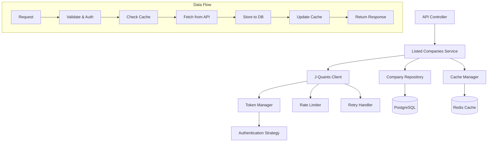

# 上場銘柄一覧取得機構 設計ドキュメント

## 概要

J-Quants APIを使用して上場銘柄一覧を取得・管理するシステムの設計書です。既存のトークン管理システムと連携し、効率的で信頼性の高い銘柄情報管理機能を提供します。

## API仕様分析

### J-Quants Listed Info API
- **エンドポイント**: `GET https://api.jquants.com/v1/listed/info`
- **認証**: Bearer認証（IDトークンが必要）
- **パラメータ**:
  - `code` (オプション): 4桁銘柄コード
  - `date` (オプション): 基準日（YYYYMMDD または YYYY-MM-DD形式）

### レスポンスフィールド
| フィールド | 型 | 説明 |
|------------|-----|------|
| Date | string | 情報適用日 |
| Code | string | 銘柄コード |
| CompanyName | string | 会社名（日本語） |
| CompanyNameEnglish | string | 会社名（英語） |
| Sector17Code | string | 17業種区分コード |
| Sector33Code | string | 33業種区分コード |
| ScaleCategory | string | 規模区分 |
| MarketCode | string | 市場区分コード |
| MarginCode | string | 信用区分（Standard/Premium限定） |

## システム設計

### 1. アーキテクチャ概要



### 2. データモデル設計

#### 2.1 Company（上場企業）モデル

```python
class Company(Base):
    """上場企業情報モデル"""
    
    __tablename__ = "companies"
    
    # 基本情報
    id: Mapped[int] = mapped_column(primary_key=True, index=True)
    code: Mapped[str] = mapped_column(String(10), unique=True, index=True, nullable=False)
    company_name: Mapped[str] = mapped_column(String(200), nullable=False)
    company_name_english: Mapped[str] = mapped_column(String(200), nullable=True)
    
    # 分類情報
    sector17_code: Mapped[Optional[str]] = mapped_column(String(10), index=True)
    sector33_code: Mapped[Optional[str]] = mapped_column(String(10), index=True)
    scale_category: Mapped[Optional[str]] = mapped_column(String(50))
    market_code: Mapped[Optional[str]] = mapped_column(String(10), index=True)
    margin_code: Mapped[Optional[str]] = mapped_column(String(10))
    
    # メタデータ
    reference_date: Mapped[date] = mapped_column(Date, nullable=False)
    is_active: Mapped[bool] = mapped_column(Boolean, default=True)
    created_at: Mapped[datetime] = mapped_column(DateTime, default=datetime.utcnow)
    updated_at: Mapped[datetime] = mapped_column(
        DateTime, 
        default=datetime.utcnow, 
        onupdate=datetime.utcnow
    )
    
    # インデックス
    __table_args__ = (
        Index('ix_companies_code_date', 'code', 'reference_date'),
        Index('ix_companies_market_sector', 'market_code', 'sector17_code'),
    )
```

#### 2.2 Sector（業種）マスターデータ

```python
class Sector17(Base):
    """17業種区分マスター"""
    
    __tablename__ = "sector17_masters"
    
    id: Mapped[int] = mapped_column(primary_key=True)
    code: Mapped[str] = mapped_column(String(10), unique=True, index=True)
    name: Mapped[str] = mapped_column(String(100), nullable=False)
    name_english: Mapped[Optional[str]] = mapped_column(String(100))
    display_order: Mapped[int] = mapped_column(Integer, default=0)

class Sector33(Base):
    """33業種区分マスター"""
    
    __tablename__ = "sector33_masters"
    
    id: Mapped[int] = mapped_column(primary_key=True)
    code: Mapped[str] = mapped_column(String(10), unique=True, index=True)
    name: Mapped[str] = mapped_column(String(100), nullable=False)
    name_english: Mapped[Optional[str]] = mapped_column(String(100))
    sector17_code: Mapped[str] = mapped_column(String(10), index=True)
    display_order: Mapped[int] = mapped_column(Integer, default=0)
```

#### 2.3 Market（市場）マスターデータ

```python
class Market(Base):
    """市場区分マスター"""
    
    __tablename__ = "market_masters"
    
    id: Mapped[int] = mapped_column(primary_key=True)
    code: Mapped[str] = mapped_column(String(10), unique=True, index=True)
    name: Mapped[str] = mapped_column(String(100), nullable=False)
    name_english: Mapped[Optional[str]] = mapped_column(String(100))
    is_active: Mapped[bool] = mapped_column(Boolean, default=True)
    display_order: Mapped[int] = mapped_column(Integer, default=0)
```

### 3. サービス層設計

#### 3.1 J-QuantsListedInfoClient

```python
class JQuantsListedInfoClient:
    """J-Quants Listed Info API クライアント"""
    
    def __init__(
        self, 
        token_manager: TokenManager,
        data_source_service: DataSourceService,
        rate_limiter: RateLimiter
    ):
        self.token_manager = token_manager
        self.data_source_service = data_source_service
        self.rate_limiter = rate_limiter
        self.base_url = "https://api.jquants.com/v1"
    
    async def get_listed_info(
        self, 
        code: Optional[str] = None,
        date: Optional[str] = None,
        pagination_key: Optional[str] = None
    ) -> Dict[str, Any]:
        """上場銘柄情報を取得"""
        
    async def get_all_listed_companies(
        self, 
        date: Optional[str] = None
    ) -> List[Dict[str, Any]]:
        """全上場銘柄を取得（ページネーション対応）"""
        
    async def get_company_by_code(
        self, 
        code: str, 
        date: Optional[str] = None
    ) -> Optional[Dict[str, Any]]:
        """特定銘柄の情報を取得"""
```

#### 3.2 ListedCompaniesService

```python
class ListedCompaniesService:
    """上場銘柄管理サービス"""
    
    def __init__(
        self,
        db: AsyncSession,
        jquants_client: JQuantsListedInfoClient,
        cache_manager: CacheManager
    ):
        self.db = db
        self.jquants_client = jquants_client
        self.cache_manager = cache_manager
    
    # データ取得・更新
    async def sync_listed_companies(
        self, 
        date: Optional[str] = None,
        force_update: bool = False
    ) -> SyncResult:
        """上場銘柄一覧の同期"""
        
    async def get_companies(
        self,
        market_code: Optional[str] = None,
        sector_code: Optional[str] = None,
        active_only: bool = True,
        limit: int = 100,
        offset: int = 0
    ) -> Tuple[List[Company], int]:
        """銘柄一覧取得（フィルタリング・ページネーション対応）"""
        
    async def get_company_by_code(
        self, 
        code: str,
        use_cache: bool = True
    ) -> Optional[Company]:
        """銘柄コードによる企業情報取得"""
        
    async def search_companies(
        self,
        query: str,
        search_type: CompanySearchType = CompanySearchType.NAME,
        limit: int = 50
    ) -> List[Company]:
        """企業検索（名前・コード）"""
        
    # マスターデータ管理
    async def get_sectors(self, type: SectorType = SectorType.SECTOR17) -> List[Dict]:
        """業種一覧取得"""
        
    async def get_markets(self, active_only: bool = True) -> List[Market]:
        """市場一覧取得"""
```

### 4. キャッシュ戦略

#### 4.1 Redis キャッシュ構造

```python
class ListedCompaniesCache:
    """上場銘柄キャッシュ管理"""
    
    # キーパターン
    COMPANY_BY_CODE = "company:code:{code}"
    COMPANY_LIST = "companies:list:{hash}"
    SECTORS = "sectors:{type}"
    MARKETS = "markets"
    SYNC_STATUS = "sync:status"
    
    # TTL設定
    CACHE_TTL = {
        "company": 3600,      # 1時間
        "list": 1800,         # 30分
        "master": 86400,      # 24時間
        "sync_status": 300    # 5分
    }
    
    async def get_company(self, code: str) -> Optional[Company]:
        """企業情報をキャッシュから取得"""
        
    async def set_company(self, company: Company) -> None:
        """企業情報をキャッシュに保存"""
        
    async def get_company_list(
        self, 
        filters: CompanyFilters
    ) -> Optional[List[Company]]:
        """企業一覧をキャッシュから取得"""
        
    async def invalidate_company_caches(self) -> None:
        """企業関連キャッシュを無効化"""
```

### 5. API エンドポイント設計

#### 5.1 RESTful API エンドポイント

```python
# 上場銘柄一覧
GET /api/v1/companies
Query Parameters:
- market_code: 市場コード
- sector17_code: 17業種コード
- sector33_code: 33業種コード
- active_only: アクティブ企業のみ (default: true)
- limit: 取得件数 (default: 100, max: 1000)
- offset: オフセット (default: 0)

# 特定銘柄情報
GET /api/v1/companies/{code}
Path Parameters:
- code: 銘柄コード

# 企業検索
GET /api/v1/companies/search
Query Parameters:
- q: 検索クエリ
- type: 検索タイプ (name|code|name_english)
- limit: 取得件数 (default: 50, max: 200)

# 同期実行
POST /api/v1/companies/sync
Body:
- date: 基準日 (optional)
- force_update: 強制更新フラグ (optional)

# マスターデータ
GET /api/v1/companies/sectors
GET /api/v1/companies/markets

# 同期状態確認
GET /api/v1/companies/sync/status
```

### 6. エラーハンドリング設計

#### 6.1 カスタム例外クラス

```python
class ListedCompaniesError(Exception):
    """上場銘柄関連エラーの基底クラス"""
    pass

class CompanyNotFoundError(ListedCompaniesError):
    """企業が見つからない"""
    pass

class SyncInProgressError(ListedCompaniesError):
    """同期処理実行中"""
    pass

class JQuantsAPIError(ListedCompaniesError):
    """J-Quants API エラー"""
    def __init__(self, message: str, status_code: int, api_response: Dict):
        super().__init__(message)
        self.status_code = status_code
        self.api_response = api_response

class RateLimitExceededError(JQuantsAPIError):
    """レート制限エラー"""
    pass
```

#### 6.2 エラーレスポンス形式

```json
{
    "error": {
        "code": "COMPANY_NOT_FOUND",
        "message": "指定された銘柄コードの企業が見つかりません",
        "details": {
            "code": "1234",
            "searched_date": "2024-01-15"
        }
    }
}
```

### 7. パフォーマンス最適化

#### 7.1 データベース最適化

```sql
-- 高速検索用インデックス
CREATE INDEX CONCURRENTLY ix_companies_active_market 
ON companies (is_active, market_code) 
WHERE is_active = true;

CREATE INDEX CONCURRENTLY ix_companies_name_gin 
ON companies USING gin(to_tsvector('japanese', company_name));

CREATE INDEX CONCURRENTLY ix_companies_code_prefix 
ON companies (code text_pattern_ops);
```

#### 7.2 キャッシュ最適化

```python
class CacheOptimization:
    """キャッシュ最適化戦略"""
    
    # 事前キャッシュ（プリウォーム）
    async def prewarm_cache(self):
        """よく使用されるデータの事前キャッシュ"""
        # 全市場一覧
        # 業種マスター
        # アクティブ企業数上位100社
        
    # バッチ無効化
    async def batch_invalidate(self, pattern: str):
        """パターンマッチによる一括キャッシュ無効化"""
        
    # 圧縮キャッシュ
    async def compress_cache_data(self, data: Any) -> bytes:
        """大容量データの圧縮キャッシュ"""
```

### 8. バッチ処理設計

#### 8.1 定期同期ジョブ

```python
class ListedCompaniesSyncJob:
    """上場銘柄定期同期ジョブ"""
    
    # 毎日営業時間後に実行
    @cron("0 18 * * 1-5")  # 平日18時
    async def daily_sync(self):
        """日次銘柄情報同期"""
        
    # 週次フル同期
    @cron("0 2 * * 0")  # 日曜2時
    async def weekly_full_sync(self):
        """週次完全同期"""
        
    # 月次マスターデータ更新
    @cron("0 3 1 * *")  # 毎月1日3時
    async def monthly_master_update(self):
        """月次マスターデータ更新"""
```

### 9. 監視・アラート設計

#### 9.1 メトリクス収集

```python
class ListedCompaniesMetrics:
    """上場銘柄関連メトリクス"""
    
    # API呼び出し統計
    api_calls_total = Counter('jquants_api_calls_total')
    api_response_time = Histogram('jquants_api_response_seconds')
    
    # データ同期統計
    sync_companies_total = Gauge('companies_synced_total')
    sync_duration = Histogram('sync_duration_seconds')
    sync_errors_total = Counter('sync_errors_total')
    
    # キャッシュ統計
    cache_hits_total = Counter('cache_hits_total')
    cache_misses_total = Counter('cache_misses_total')
```

#### 9.2 アラート設定

```yaml
alerts:
  - name: JQuantsAPIDown
    condition: jquants_api_calls_total{status="error"} > 5
    duration: 5m
    
  - name: SyncJobFailed
    condition: sync_errors_total > 0
    duration: 1m
    
  - name: CacheHitRateLow
    condition: (cache_hits_total / (cache_hits_total + cache_misses_total)) < 0.8
    duration: 10m
```

### 10. セキュリティ考慮事項

#### 10.1 データアクセス制御

```python
class CompanyDataAccess:
    """企業データアクセス制御"""
    
    # APIキーベースアクセス制御
    async def check_api_access(self, api_key: str, endpoint: str):
        """APIアクセス権限確認"""
        
    # レート制限
    async def apply_rate_limit(self, user_id: str, endpoint: str):
        """ユーザー別レート制限適用"""
        
    # データマスキング
    async def mask_sensitive_data(self, company: Company, user_role: str):
        """機密データのマスキング"""
```

### 11. テスト戦略

#### 11.1 テスト分類

```python
# ユニットテスト
class TestJQuantsListedInfoClient:
    """J-Quants APIクライアントのテスト"""
    
class TestListedCompaniesService:
    """上場銘柄サービスのテスト"""

# 統合テスト
class TestListedCompaniesIntegration:
    """上場銘柄機能の統合テスト"""
    
# E2Eテスト
class TestListedCompaniesE2E:
    """上場銘柄機能のE2Eテスト"""
```

### 12. デプロイメント戦略

#### 12.1 マイグレーション計画

```python
# Phase 1: データベーススキーマ作成
# Phase 2: サービス層実装・デプロイ
# Phase 3: API エンドポイント公開
# Phase 4: バッチ処理開始
# Phase 5: 監視・アラート設定

class DeploymentPlan:
    """デプロイメント計画"""
    
    async def phase1_create_schema(self):
        """Phase 1: スキーマ作成"""
        
    async def phase2_deploy_services(self):
        """Phase 2: サービスデプロイ"""
        
    async def phase3_enable_api(self):
        """Phase 3: API有効化"""
```

## 実装進捗状況

### ✅ 完了済み実装

#### Phase 1: データベース基盤（2025-06-26 完了）

##### 1. データモデル実装 - `app/models/company.py`
- ✅ **Company**: 上場企業基本情報モデル
  - 銘柄コード、企業名（日/英）、業種・市場分類
  - 基準日、アクティブフラグ、タイムスタンプ
- ✅ **Sector17Master**: 17業種区分マスター（18件）
- ✅ **Sector33Master**: 33業種区分マスター（34件）
- ✅ **MarketMaster**: 市場区分マスター（10件）
- ✅ **CompanySyncHistory**: 企業データ同期履歴

##### 2. マイグレーション実装・実行
- ✅ **c2e3a9be79f7**: 全5テーブル作成
  - `companies`, `sector17_masters`, `sector33_masters`
  - `market_masters`, `company_sync_history`
- ✅ **8aff57aa15b6**: マスターデータ投入
  - 市場マスター: 10件（プライム、スタンダード、グロース等）
  - 17業種マスター: 18件（食品、エネルギー、建設等）
  - 33業種マスター: 34件（詳細業種分類）
- ✅ **1479a1bf7b47**: 外部キー制約追加
  - 企業⇔マスターの参照整合性
  - 33業種⇔17業種の階層関係

##### 3. データベース最適化
- ✅ **PostgreSQL拡張機能**
  - `pg_trgm`: トリグラム検索（部分一致高速化）
  - `uuid-ossp`: UUID生成機能
  - `btree_gin`: GINインデックス拡張
- ✅ **高速検索インデックス**
  ```sql
  -- 基本検索用
  ix_companies_code (UNIQUE)        -- 銘柄コード
  ix_companies_market_code          -- 市場区分
  ix_companies_sector17_code        -- 17業種
  ix_companies_sector33_code        -- 33業種
  
  -- 複合検索用  
  ix_companies_active_market        -- アクティブ×市場
  ix_companies_active_sector17      -- アクティブ×17業種
  ix_companies_market_sector        -- 市場×業種
  ix_companies_code_date           -- 銘柄コード×基準日
  
  -- 全文検索用（GIN）
  ix_companies_name_search          -- 企業名部分一致（トリグラム）
  ```

##### 4. データ整合性設計
- ✅ **外部キー制約による参照整合性**
  ```sql
  -- 企業⇔マスターテーブル
  fk_companies_market_code    (ON DELETE SET NULL)
  fk_companies_sector17_code  (ON DELETE SET NULL)  
  fk_companies_sector33_code  (ON DELETE SET NULL)
  
  -- マスター間階層関係
  fk_sector33_sector17_code   (ON DELETE RESTRICT)
  ```
- ✅ **論理削除による履歴保持**: `is_active`フラグ
- ✅ **タイムスタンプ管理**: 全テーブルで`created_at`, `updated_at`

##### 5. 運用環境設定
- ✅ **Docker環境自動初期化**
  - `docker/postgres/init.sql`: 拡張機能自動有効化
  - `docker-compose.yml`: 初期化スクリプト連携
- ✅ **マイグレーション管理体制**
  - Alembicによるバージョン管理
  - 環境間での一貫したスキーマ適用
- ✅ **動作確認完了**
  - 全マスターデータ投入確認
  - 外部キー制約動作確認
  - JOIN検索動作確認

### 🔄 実装予定（次のフェーズ）

#### Phase 2: J-Quants APIクライアント実装
1. **APIクライアント基盤**
   - J-QuantsListedInfoClient実装
   - 認証トークン管理との連携
   - レート制限・リトライ機能

2. **データ取得機能**
   - 全銘柄一覧取得（ページネーション対応）
   - 特定銘柄情報取得
   - 差分更新機能

#### Phase 3: サービス層・API実装
1. **ListedCompaniesService実装**
   - CRUD操作
   - キャッシュ機能
   - 検索機能

2. **RESTful API エンドポイント**
   - GET /api/v1/companies
   - GET /api/v1/companies/{code}
   - GET /api/v1/companies/search
   - POST /api/v1/companies/sync

#### Phase 4: 運用機能
1. **バッチ処理・監視**
   - 定期同期ジョブ
   - メトリクス収集
   - アラート設定

### 🎯 技術的実装詳細

#### データベース設計の特徴
- **正規化**: 業種・市場マスターの分離による正規化
- **パフォーマンス**: GINインデックスによる高速文字列検索
- **履歴管理**: 同期履歴テーブルによる運用監視
- **拡張性**: コメント付きカラムによる保守性

#### GINインデックスによる検索機能
```sql
-- 以下の検索が高速実行可能
SELECT * FROM companies WHERE company_name LIKE '%トヨタ%';
SELECT * FROM companies WHERE company_name % 'トヨタ自動車';  -- 類似度検索
```

#### Docker環境での自動セットアップ
```bash
# 新環境での自動初期化
docker-compose up  # PostgreSQL拡張が自動有効化
```

### 📈 実装優先順位（更新版）

#### 次回実装タスク
1. **J-Quants Listed Info APIクライアント実装**
2. **基本的なサービス層実装**
3. **初期マスターデータ投入機能**

#### 中期実装計画
1. **API エンドポイント実装**
2. **キャッシュ機能実装**
3. **検索機能実装**

#### 長期実装計画
1. **バッチ処理・同期機能**
2. **監視・メトリクス**
3. **パフォーマンス最適化**

## 期待される効果

1. **効率的な銘柄情報管理**: リアルタイムかつ正確な上場銘柄情報の提供
2. **高速検索**: インデックス最適化とキャッシュによる高速検索
3. **スケーラビリティ**: 大量データに対応する設計
4. **信頼性**: 堅牢なエラーハンドリングと監視体制
5. **保守性**: モジュラー設計による保守性の向上

この設計により、J-Quantsの上場銘柄情報を効率的に取得・管理し、アプリケーションに高品質な企業データを提供できます。