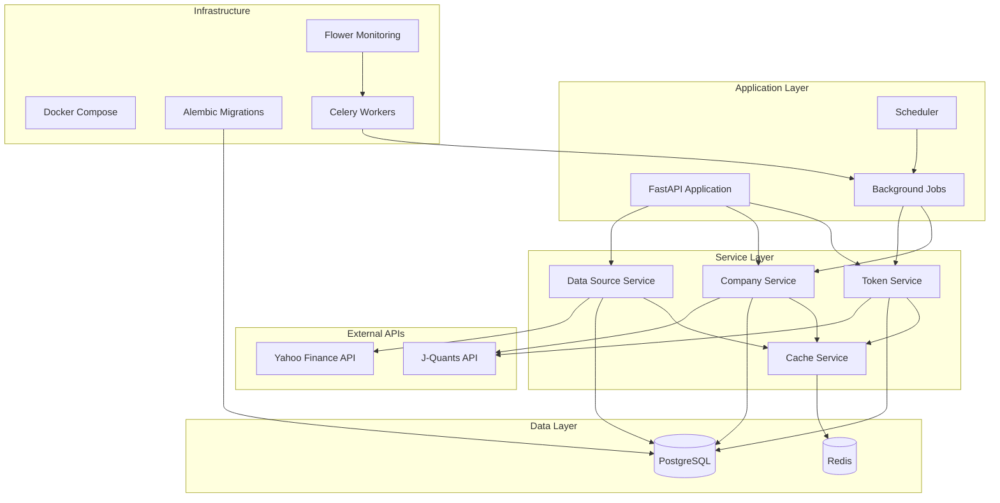

# 技術アーキテクチャ設計書

## 概要

上場銘柄一覧管理システムの技術アーキテクチャを定義します。マイクロサービス的なアプローチで設計され、各コンポーネントが疎結合で連携する構成となっています。

## システム全体アーキテクチャ

### 1. アーキテクチャ概要図



### 2. レイヤー構成

#### Presentation Layer (API Layer)
- **FastAPI**: RESTful API エンドポイント
- **Pydantic**: リクエスト・レスポンス データ検証
- **OpenAPI**: 自動API ドキュメント生成

#### Application Layer (Service Layer)  
- **Token Management**: J-Quants 認証トークン管理
- **Company Management**: 企業情報CRUD操作
- **Data Source Management**: データソース設定管理
- **Cache Management**: Redis キャッシュ制御

#### Infrastructure Layer
- **Database**: PostgreSQL (主データ永続化)
- **Cache**: Redis (高速データアクセス)
- **Background Jobs**: Celery (非同期タスク処理)
- **Container**: Docker Compose (開発環境)

## コンポーネント設計

### 1. 認証・トークン管理

#### TokenManager (`app/services/token_manager.py`)
```python
class TokenManager:
    """J-Quants API トークン管理"""
    
    def __init__(self):
        self.refresh_tokens: Dict[int, Tuple[str, datetime]] = {}
        self.id_tokens: Dict[int, Tuple[str, datetime]] = {}
        self._lock = asyncio.Lock()
    
    async def get_valid_id_token(self, data_source_id: int) -> Optional[str]:
        """有効なIDトークンを取得（自動リフレッシュ）"""
        
    async def refresh_id_token(self, data_source_id: int) -> Optional[str]:
        """IDトークンをリフレッシュ"""
        
    async def store_refresh_token(self, data_source_id: int, token: str, expires_at: datetime):
        """リフレッシュトークンを保存"""
```

#### AutoTokenRefresh (`app/services/token_manager.py`)
```python
class AutoTokenRefresh:
    """自動トークンリフレッシュ機能"""
    
    def __init__(self, token_manager: TokenManager):
        self.token_manager = token_manager
        self.refresh_tasks: Dict[int, asyncio.Task] = {}
    
    async def start_auto_refresh(self, data_source_id: int):
        """自動リフレッシュタスクを開始"""
        
    async def stop_auto_refresh(self, data_source_id: int):
        """自動リフレッシュタスクを停止"""
```

### 2. データソース管理

#### DataSourceService (`app/services/data_source.py`)
```python
class DataSourceService:
    """データソース設定管理サービス"""
    
    def __init__(self, db: AsyncSession):
        self.db = db
        self.encryption_service = EncryptionService()
    
    async def get_by_provider(self, provider: str) -> Optional[DataSource]:
        """プロバイダー別データソース取得"""
        
    async def get_decrypted_credentials(self, data_source: DataSource) -> Dict[str, Any]:
        """暗号化された認証情報を復号化"""
        
    async def update_credentials(self, data_source_id: int, credentials: Dict[str, Any]):
        """認証情報を暗号化して更新"""
```

### 3. 企業情報管理（予定実装）

#### CompanyService
```python
class CompanyService:
    """企業情報管理サービス"""
    
    def __init__(self, db: AsyncSession, cache: CacheService):
        self.db = db
        self.cache = cache
    
    async def get_companies(
        self,
        market_code: Optional[str] = None,
        sector_code: Optional[str] = None,
        active_only: bool = True,
        limit: int = 100,
        offset: int = 0
    ) -> Tuple[List[Company], int]:
        """企業一覧取得（フィルタリング・ページネーション）"""
        
    async def search_companies(self, query: str, limit: int = 50) -> List[Company]:
        """企業名検索（GINインデックス使用）"""
        
    async def sync_from_api(self, date: Optional[str] = None) -> SyncResult:
        """J-Quants APIから企業情報同期"""
```

#### JQuantsCompanyClient
```python
class JQuantsCompanyClient:
    """J-Quants Listed Info API クライアント"""
    
    def __init__(self, token_manager: TokenManager):
        self.token_manager = token_manager
        self.base_url = "https://api.jquants.com/v1"
    
    async def get_listed_info(
        self,
        code: Optional[str] = None,
        date: Optional[str] = None,
        pagination_key: Optional[str] = None
    ) -> Dict[str, Any]:
        """上場銘柄情報取得"""
        
    async def get_all_companies(self, date: Optional[str] = None) -> List[Dict]:
        """全企業情報取得（ページネーション自動処理）"""
```

### 4. キャッシュ管理

#### CacheService
```python
class CacheService:
    """Redis キャッシュ管理サービス"""
    
    def __init__(self, redis_client: Redis):
        self.redis = redis_client
    
    async def get_company(self, code: str) -> Optional[Company]:
        """企業情報キャッシュ取得"""
        
    async def set_company(self, company: Company, ttl: int = 3600):
        """企業情報キャッシュ設定"""
        
    async def get_company_list(self, cache_key: str) -> Optional[List[Company]]:
        """企業一覧キャッシュ取得"""
        
    async def invalidate_pattern(self, pattern: str):
        """パターンマッチによる一括無効化"""
```

## データベース設計

### 1. スキーマ構成

#### 企業情報スキーマ
```sql
-- 企業基本情報
Table: companies
- id (SERIAL, PK)
- code (VARCHAR(10), UNIQUE) -- 銘柄コード
- company_name (VARCHAR(200)) -- 企業名
- company_name_english (VARCHAR(200)) -- 企業名(英語)
- sector17_code (VARCHAR(10), FK) -- 17業種
- sector33_code (VARCHAR(10), FK) -- 33業種  
- market_code (VARCHAR(10), FK) -- 市場区分
- margin_code (VARCHAR(10)) -- 信用区分
- scale_category (VARCHAR(50)) -- 規模区分
- reference_date (DATE) -- 基準日
- is_active (BOOLEAN) -- アクティブフラグ
- created_at (TIMESTAMP)
- updated_at (TIMESTAMP)
```

#### マスターデータスキーマ
```sql
-- 市場区分マスター
Table: market_masters
- id (SERIAL, PK)
- code (VARCHAR(10), UNIQUE)
- name (VARCHAR(100))
- name_english (VARCHAR(100))
- description (TEXT)
- display_order (INTEGER)
- is_active (BOOLEAN)

-- 17業種マスター
Table: sector17_masters  
- id (SERIAL, PK)
- code (VARCHAR(10), UNIQUE)
- name (VARCHAR(100))
- name_english (VARCHAR(100))
- description (TEXT)
- display_order (INTEGER)
- is_active (BOOLEAN)

-- 33業種マスター
Table: sector33_masters
- id (SERIAL, PK) 
- code (VARCHAR(10), UNIQUE)
- name (VARCHAR(100))
- name_english (VARCHAR(100))
- description (TEXT)
- sector17_code (VARCHAR(10), FK)
- display_order (INTEGER)
- is_active (BOOLEAN)
```

### 2. インデックス戦略

#### 検索最適化インデックス
```sql
-- 基本検索用
CREATE UNIQUE INDEX ix_companies_code ON companies (code);
CREATE INDEX ix_companies_market_code ON companies (market_code);
CREATE INDEX ix_companies_sector17_code ON companies (sector17_code);

-- 複合検索用
CREATE INDEX ix_companies_active_market ON companies (is_active, market_code);
CREATE INDEX ix_companies_market_sector ON companies (market_code, sector17_code);

-- 全文検索用（GIN）
CREATE INDEX ix_companies_name_search ON companies 
USING gin (company_name gin_trgm_ops);
```

#### 外部キー制約
```sql
-- 参照整合性保証
ALTER TABLE companies 
ADD CONSTRAINT fk_companies_market_code 
FOREIGN KEY (market_code) REFERENCES market_masters(code) ON DELETE SET NULL;

ALTER TABLE sector33_masters 
ADD CONSTRAINT fk_sector33_sector17_code 
FOREIGN KEY (sector17_code) REFERENCES sector17_masters(code) ON DELETE RESTRICT;
```

## API設計

### 1. RESTful エンドポイント

#### 企業情報API
```python
# 企業一覧取得
GET /api/v1/companies
Query Parameters:
- market_code: 市場コード
- sector17_code: 17業種コード  
- sector33_code: 33業種コード
- active_only: アクティブ企業のみ (default: true)
- limit: 取得件数 (default: 100, max: 1000)
- offset: オフセット (default: 0)

Response:
{
    "companies": [...],
    "total": 1234,
    "limit": 100,
    "offset": 0
}

# 特定企業取得
GET /api/v1/companies/{code}
Response:
{
    "code": "7203",
    "company_name": "トヨタ自動車株式会社",
    "company_name_english": "Toyota Motor Corporation",
    "market_code": "0111",
    "sector17_code": "6",
    "sector33_code": "3700",
    ...
}

# 企業検索
GET /api/v1/companies/search?q=トヨタ&limit=50
Response:
{
    "companies": [...],
    "total": 5,
    "query": "トヨタ"
}
```

#### マスターデータAPI
```python
# 市場一覧取得
GET /api/v1/companies/markets
Response:
{
    "markets": [
        {"code": "0111", "name": "プライム", "name_english": "Prime"},
        {"code": "0112", "name": "スタンダード", "name_english": "Standard"},
        ...
    ]
}

# 業種一覧取得
GET /api/v1/companies/sectors?type=17
Response:
{
    "sectors": [
        {"code": "1", "name": "食品", "name_english": "Food"},
        {"code": "2", "name": "エネルギー資源", "name_english": "Energy Resources"},
        ...
    ]
}
```

#### 同期管理API
```python
# データ同期実行
POST /api/v1/companies/sync
Request Body:
{
    "date": "2025-06-26",  # Optional
    "force_update": false  # Optional
}
Response:
{
    "sync_id": "uuid",
    "status": "running",
    "started_at": "2025-06-26T10:00:00Z"
}

# 同期状態確認
GET /api/v1/companies/sync/status
Response:
{
    "current_sync": {
        "sync_id": "uuid", 
        "status": "completed",
        "total_companies": 4000,
        "new_companies": 10,
        "updated_companies": 50,
        "started_at": "2025-06-26T10:00:00Z",
        "completed_at": "2025-06-26T10:05:00Z"
    },
    "last_successful_sync": "2025-06-25T18:00:00Z"
}
```

### 2. エラーハンドリング

#### 統一エラーレスポンス
```json
{
    "error": {
        "code": "COMPANY_NOT_FOUND",
        "message": "指定された銘柄コードの企業が見つかりません",
        "details": {
            "code": "1234",
            "searched_date": "2025-06-26"
        }
    }
}
```

#### HTTPステータスコード規約
- **200**: 成功
- **201**: 作成成功
- **400**: リクエストエラー
- **401**: 認証エラー
- **403**: 権限エラー
- **404**: リソース未発見
- **429**: レート制限
- **500**: サーバーエラー
- **503**: サービス利用不可

## キャッシュ戦略

### 1. Redis キャッシュ設計

#### キーパターン
```python
# 企業情報キャッシュ
"company:code:{code}"              # 企業個別情報
"companies:list:{hash}"            # 企業一覧（フィルター条件のハッシュ）
"companies:search:{query_hash}"    # 検索結果

# マスターデータキャッシュ  
"masters:markets"                  # 市場一覧
"masters:sectors:17"               # 17業種一覧
"masters:sectors:33"               # 33業種一覧

# 同期状態キャッシュ
"sync:status"                      # 現在の同期状態
"sync:history:{date}"              # 日別同期履歴
```

#### TTL設定
```python
CACHE_TTL = {
    "company": 3600,        # 1時間（企業個別）
    "company_list": 1800,   # 30分（企業一覧） 
    "search": 1800,         # 30分（検索結果）
    "masters": 86400,       # 24時間（マスターデータ）
    "sync_status": 300,     # 5分（同期状態）
}
```

### 2. キャッシュ無効化戦略

#### 階層的無効化
```python
# 企業データ更新時
await cache.invalidate_pattern("company:*")
await cache.invalidate_pattern("companies:*")

# マスターデータ更新時  
await cache.invalidate_pattern("masters:*")
await cache.invalidate_pattern("companies:*")  # 企業一覧も無効化

# 同期完了時
await cache.invalidate_pattern("companies:*")
await cache.set("sync:status", new_status, ttl=300)
```

## セキュリティ設計

### 1. 認証・認可

#### API キー認証
```python
# APIキーによるアクセス制御
@app.middleware("http")
async def api_key_middleware(request: Request, call_next):
    if request.url.path.startswith("/api/"):
        api_key = request.headers.get("X-API-Key")
        if not await validate_api_key(api_key):
            return JSONResponse(
                status_code=401,
                content={"error": {"code": "INVALID_API_KEY"}}
            )
    return await call_next(request)
```

#### レート制限
```python
# Redis によるレート制限
@app.middleware("http") 
async def rate_limit_middleware(request: Request, call_next):
    client_id = get_client_id(request)
    
    # スライディングウィンドウでレート制限
    current_count = await redis.incr(f"rate_limit:{client_id}")
    if current_count == 1:
        await redis.expire(f"rate_limit:{client_id}", 3600)  # 1時間
    
    if current_count > 1000:  # 1時間あたり1000リクエスト
        return JSONResponse(
            status_code=429,
            content={"error": {"code": "RATE_LIMIT_EXCEEDED"}}
        )
    
    return await call_next(request)
```

### 2. データ保護

#### 機密情報暗号化
```python
class EncryptionService:
    """認証情報暗号化サービス"""
    
    def __init__(self):
        self.cipher = Fernet(settings.ENCRYPTION_KEY)
    
    def encrypt(self, data: str) -> str:
        """データを暗号化"""
        return self.cipher.encrypt(data.encode()).decode()
    
    def decrypt(self, encrypted_data: str) -> str:
        """データを復号化"""
        return self.cipher.decrypt(encrypted_data.encode()).decode()
```

## 監視・ロギング

### 1. アプリケーション監視

#### メトリクス収集
```python
from prometheus_client import Counter, Histogram, Gauge

# API呼び出し統計
api_requests_total = Counter('api_requests_total', 'Total API requests', ['method', 'endpoint', 'status'])
api_request_duration = Histogram('api_request_duration_seconds', 'API request duration')

# J-Quants API統計  
jquants_api_calls = Counter('jquants_api_calls_total', 'J-Quants API calls', ['status'])
jquants_response_time = Histogram('jquants_response_time_seconds', 'J-Quants response time')

# データベース統計
db_connections = Gauge('db_connections_active', 'Active database connections')
db_query_duration = Histogram('db_query_duration_seconds', 'Database query duration')

# キャッシュ統計
cache_hits = Counter('cache_hits_total', 'Cache hits', ['cache_type'])
cache_misses = Counter('cache_misses_total', 'Cache misses', ['cache_type'])
```

#### 構造化ログ
```python
import structlog

logger = structlog.get_logger()

# API アクセスログ
logger.info("api_request", 
    method=request.method,
    path=request.url.path,
    user_id=user_id,
    response_status=response.status_code,
    duration_ms=duration
)

# J-Quants API呼び出しログ
logger.info("jquants_api_call",
    endpoint="/listed/info", 
    company_code=code,
    response_status=200,
    companies_count=len(companies)
)
```

### 2. エラー監視

#### 例外追跡
```python
@app.exception_handler(Exception)
async def global_exception_handler(request: Request, exc: Exception):
    logger.error("unhandled_exception",
        exception=str(exc),
        traceback=traceback.format_exc(),
        request_path=request.url.path,
        request_method=request.method
    )
    
    return JSONResponse(
        status_code=500,
        content={"error": {"code": "INTERNAL_SERVER_ERROR"}}
    )
```

## デプロイメント・インフラ

### 1. 開発環境 (Docker Compose)

#### 構成
```yaml
services:
  web:        # FastAPI Application
  worker:     # Celery Background Workers  
  redis:      # Cache & Message Broker
  db:         # PostgreSQL Database
  flower:     # Celery Monitoring
```

### 2. 本番環境（予定）

#### コンテナオーケストレーション
- **Kubernetes**: マイクロサービス管理
- **Helm**: アプリケーションパッケージ管理
- **Ingress**: ロードバランサー・SSL終端

#### 外部サービス
- **Cloud SQL**: マネージドPostgreSQL
- **Cloud Memory Store**: マネージドRedis  
- **Cloud Storage**: ファイル保存
- **Cloud Monitoring**: メトリクス・ログ収集

この技術アーキテクチャにより、スケーラブルで保守性の高いシステムを構築できます。